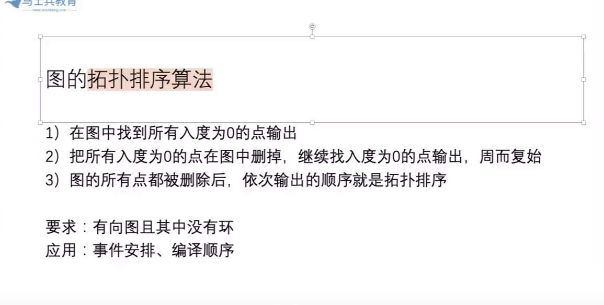
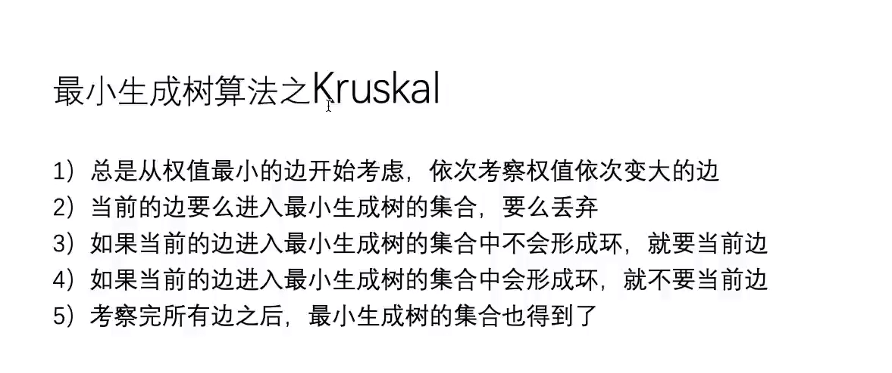
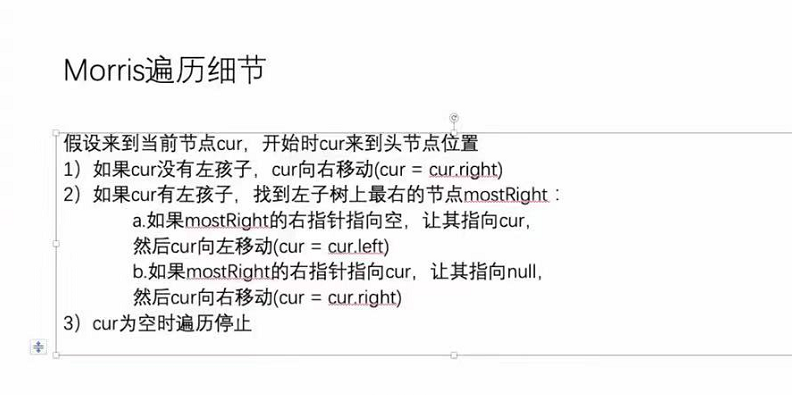

### 跳跃游戏全系列
[1 跳跃游戏I](jumpGame/Jump.java) 
- https://leetcode-cn.com/problems/jump-game/


[2 跳跃游戏II](jumpGame/Jump.java) 
- https://leetcode-cn.com/problems/jump-game-ii/

[3 青蛙过河（跳石子过河）](jumpGame/FrogCanCross.java) 
- https://leetcode-cn.com/problems/frog-jump/
```
1. map反向索引表， <stones[i], i>， 可以快速定位 1. 跳到的位置是否存在 2.存在的话，O(1)返回下标
2. 注意题目说明了， 不回跳 -> 跳跃步数 >= 0
3. 再次根据题目， 跳跃距离的范围 是 [0, N - 1] -> 在 i位置的 lastDistance最大为 i
4. 对于时间测量而言，我测了一下 记忆化搜索不同 cache结构的时间：
    - 多个参数使用String.valueOf连起来 HashMap<String, Boolean> -> 最慢的
    - HashMap<Integer, HashMap<Integer, Boolean>> -> 快 2/3
    - 如果可以使用数组当然好，但是本题需要分析出来 lastDist范围是固定的这件事情，最快 —— 36ms
5. 由于 测出有一条路径能够 最后一个石子 就够了，所以可以进行剪枝
- 事实证明，虽然多了几行代码，但是常数时间快了一倍
```


### 股票买卖全系列
关键点： 从左往右尝试模型 -> 考虑 最后一个位置是否参与 从而划分出两个大类！！！

- [股票I](sellstock/StockCollection.java):
- https://leetcode.com/problems/best-time-to-buy-and-sell-stock/
- 只进行一次交易

- [股票II](sellstock/StockCollection.java):
- https://leetcode.com/problems/best-time-to-buy-and-sell-stock-ii/
- 任意次数
- （首选）方法一： 波峰波谷图，求每一个波峰的高度  -> ans += Math.max(prices[i] - prices[i - 1], 0)
- 方法二： 动态规划 + 斜率优化

- [股票III](sellstock/StockCollection.java):
- https://leetcode.com/problems/best-time-to-buy-and-sell-stock-iii/
- !! 给定次数，两次.  只允许做不超过两次的交易
- 可以不使用动态规划做
- 怎么做呢 - O（N） + O（1）
- （首选）最优解， 很强的一个贪心：假设每一个位置上的数字 是第二次卖出的时刻， 遍历一遍，求最大值
  - 需要设置几个变量
  - 假设每一个位置的前面已经有过一次最好的max并且计算了max-[后续中的最小] ，那么由于我们计算的是当前位置为第二次卖出的情况
  - 所以统计每次的答案即可
  - 具体一点，对于每一个位置，首先计算 
      【1】当前作为第二次卖出的价格 
      【2】到目前为止，最好的第一次卖出的价格 
      【3】到目前为止，最好的卖出 + 最好的买入的价格（也就是 第一次卖出-该卖出点后面的最低买入点 的最佳值）
  - 贪心在 如果后面更新了 onceMax（第一次交易的最大值），那么后续如果出现了能让之前的onceMax-prices[i]变大的数字，那么新的curMax-prices[i]一定是当前最优解
    所以，在最关键的变量 onceMinusBuyMax中，只需要查看是否 当前位置作为买入点，是否比之前的onceMinusBuyMax就好了
- [股票IV](sellstock/StockCollection.java):
- https://leetcode.com/problems/best-time-to-buy-and-sell-stock-iv/
- 固定K次
- 动态规划 + 斜率优化
- E.G. 对于 dp[3][4]， 考虑两个大情况 3位置不参与(dp[2][4]) 和 3位置参与 的情况， 然后在3位置参与情况下细分

- [股票V](sellstock/StockCollection.java):
- https://leetcode.com/problems/best-time-to-buy-and-sell-stock-with-cooldown/
- 与 II 问题一样是无限次的交易，只是添加了 coolDown de 要求
- cooldown： cool down 问题， 卖出时刻之后 必须等待一个时刻，才可以继续开始买卖， 无限次交易
- buy[22] 表示 在 0-22范围内无限次交易下所获得的最优收入 - 综合考虑后的优良买入时机对应价格，   --> 综合起来之后的【最优】 就是 buy[22]
- sell[i] 表示 0-i 范围内无限次交易，最后一次是 卖动作 所能获得的最大收益
- [股票VI](sellstock/StockCollection.java):    
- https://leetcode.com/problems/best-time-to-buy-and-sell-stock-with-transaction-fee/
- 带手续费
- 与问题V相同，方法也相同
- buy[i]0-i范围上，最后一个动作必须是买，的整体最优     sell[i]最后一个动作是卖的最大利润


### 数据结构设计题
[1] 哈希表的设计，实现 setAll() 方法，要求O(1)时间

[2] （重要）已知一个消息流会不断地吐出整数1~N，但不一定按照顺序依次吐出，如果上次打印的序号为i， 那么当i+1出现时
请打印i+1及其之后接收过的并且连续的所有数，直到1~N全部接收并打印完，请设计这种接收并打印的结构
- 两张哈希表， 一张连续区间头表， 一张连续区间尾表
    - 哈希表内部结构 头表 <5， 1>  =》 以5开头长度为1


[3 LRU](dataStructureDesign/LRU.java) 
- https://leetcode-cn.com/problems/lru-cache/
- 具体错误点看代码，注意细节 -> 什么时候需要更新doubleLinkedList (get方法和put方法中 都需要考虑)
- 双向链表 + 哈希表

[4 LFU] 

[5] Top K 字符串问题【Hard】
```
Top K Frequent Words II
Implement three methods for Topk Class:
TopK(k). The constructor.
add(word). Add a new word.
topk(). Get the current top k frequent words.
LintCode题目：https://www.lintcode.com/problem/550/
```
- 加强堆 -> 多一张反向索引表 (key -> index)


### 最长递增子序列模型 - 系列 
```
LIS问题，好好理解。 
order < a 的最右 位置为pre， 
【1】将a放在 （pre + 1）位置上，即 (pre + 1) + 1 就是以a结尾的LIS。
【2】将a放在 （pre + 1）位置上，此时整个order数组中，有效的最长长度 就是 0-a下标 范围内的 LIS。
```

[1 最长递增子序列](longestIncreasingSubsequence/LongestIncreasingSubseq.java) 
- https://leetcode-cn.com/problems/longest-increasing-subsequence/
- O(N logN)  -> 新建数组（存储当前的最长子序列，并将每一个位置更新为最小的元素） + 二分法


[2 俄罗斯套娃问题](longestIncreasingSubsequence/maxEnvelopes.java) 
- https://leetcode-cn.com/problems/russian-doll-envelopes/
- 使用 最长严格递增子序列 模型
    - 首选对数组排序 -> 实现 一维顺序，二维逆序。 此时，如果出现 后边h比前边的h大，那么w也一定大
    - 直接对 数组的第二维元素进行 最长递增子序列模型 往上套就可以 （创建数组记录最长递增子序列 —> 遍历 -> 二分查找）
    - 排序 O（N logN）, 最长递增子序列模型 O（N logN）

[3 (easy题，变种题)最长连续递增子序列](longestIncreasingSubsequence/FindLengthOfLCIS.java) 
- https://leetcode-cn.com/problems/longest-continuous-increasing-subsequence/

[673. 最长递增子序列的个数](topInterviewHardQuestions/FindNumOfLIS.java) 难题
- ArrayList<有序表> + 二分法 O（N*logN）
- 解法：
  - （1）在 ArrayList<TreeMap> 上做 二分 （比较的是 TreeMap的 firstKey, 算的是 下标位置）
  - （2）TreeMap中， 同一个TreeMap的位置，一定是 后进的key是比前面小的（因为比当前大的话就会二分到后面了（二分是二分的 >= num 的最左位置））
  - （2）续： 后进的小K，把它的值 <K,V> 中的这个V ，算成【他自己对应的 count + 当前firstKey对应的值】
  - （3）这样做的原因是， 当新的num来临时，假设定位为len，他会去len-1的treeMap去算它的count，那么算法就是
    - len-1 的treemap中， firstEntry.getValue() - (p.ceilingKey(num) != null ? p.get(p.ceilingKey(num)) : 0)
        -PS: ceilingKey 是 >= num 的 最小 （真实存在的key）/ 其实也可以寻找 <= num的最大值，然后返回的下标 + 1 的位置就是 当前这个num该在的位置
    - 这种方式可以让我们在 O（log N）（查询）时间计算出 当前num 对应的 最长递增子序列的数量
  - 总结，也就是说，treeMap中 每来一个num，它的value 是 当前treemap的总数量+他自己的cnt。 这种方式来存储 数量区间（能够快速求出一个区间内的 子序列数量）
- O（N * logN） -> search操作是logN， 有序表操作也是logN, 每个num都做相同的操作，所以最后就是 O（N* logN）
[334. 是否存在递增的三元子序列]
- 方法一： 阉割版的 最长递增子序列 （可以更改 int[3] + 顺序遍历就可以）
- 方法二： 贪心思想
  - 贪心思想： 每次找寻 最小的 first 和 second （保证 second > first）


### 子数组达到规定累加和 的 最长数组长度 系列
[1 （一连问题）非负整数达到规定累加和] 
- 双指针滑动窗口

[2 （二连问题）整数达到规定累加和] 
- 前缀和数组 + HashMap

[3 （三连问题）整数达到规定累加和<=M 的 最长子数组长度] 
- dp， 创建两个数组 


### 并查集 （HashMap 与 数组实现）
[1]UnionFindSet 哈希表实现 -> 可用于 Kruskal算法
[2]数组实现
  - 数组形式实现的并查集要求 输入进来的数字可以区分开来
  - 或者类似于 N个数字之间进行并查集 / 二维数组进行并查集（因为二维数组的每个下标可以转换成唯一的一维下标 【行号*列数 + 列号】）
  - 只不过将 parentMap 和 sizeMap 变成了 int[] ，    然后 路径压缩的时候 使用了数组的stack 
  - 代码中为 针对岛屿问题类的 二维数组的 特定制作的 数组形式 实现的并查集
  - 也可以用作 LC547 省份数量 的 一维

[3。 LC547 省份数量] （并查集入门）
- 并查集 -> 一维数组并查集
- DFS/BFS
  - DFS 和 BFS 核心是一样的，都是使用 boolean[] visited来做 防重复访问以及 连通分量的计数。  【核心】对一个未被访问过的节点 进行 DFS/BFS遍历就把相连通（的全部邻居/间接邻居）的全部遍历为true,从而组成连通分量。最后计算 总函数中 计算了几次连通分量即可。

### 图论基础
- 首先，可以认为所有的图都是有向图，那么无向图是什么呢？ 可以把无向图看作是双向的有向图。
- 常规的表达方式：
  - 邻接表法
  - 邻接矩阵法
- 图的问题不熟练的话，就将它们统一转成一种结构 我们自己定义的 class Node
- 以下 [1][2][3]分别为点，边，图（包含点集边集） 来组成 易理解的结构。（面向对象强一点）

[1. 点定义]
- 注意，我们定义的Node中是尽可能的包含完整的属性，但是在具体的题目过程中，可以按照题目需要来往里面 设置相应的属性，要灵活。
```java
public class Node {
    int val;    //  当前结点的值，或者区分ID
    int in;     //  当前节点的入度
    int out;    //  当前结点的出度
    ArrayList<Node> nexts;    // 该点指向的邻居
    ArrayList<Edge> edges;    // 该点出发的边

    public Node(int v) {
        val = v;
        in = 0;
        out = 0;
        nexts = new ArrayList<>();
        edges = new ArrayList<>();
    }
}
```

[2. 边定义]
```java
public class Edge {

    int weight;   // 边的 权重
    Node from;    // 从哪一个节点出发的
    Node to;      // 到哪一个节点的

    public Edge(int weight, Node from, Node to) {
        this.weight = weight;
        this.from = from;
        this.to = to;
    }
}
```

[3. 图定义]
- 有了点，有了边，建图
- 图包含了 点集 + 边集
```java
public class Graph {
    HashMap<Integer, Node> nodes;   // 点集，当用户输入int时，value匹配到对应的节点
    HashSet<Edge> edges;            // 边集
    
    public Graph() {
        nodes = new HashMap<>();
        edges = new HashSet<>();
    }
}
```

[4. 将用户输入的奇葩结构转化成我们熟悉的图举例](graph/GraphGenerator.java)
- 转成上述结构
- 按照 题目要求 对对应的结构 进行属性的删减

[5. BFS]
- 用一个队列就行了 + optional: Set
- 但是 图的BFS，一般要加一个set， 防止出现回路导致 重复元素入队列 
  - 因为图里面可能有回路
- **解法** ：
  - 当一个元素从队列弹出时，遍历它的所有 Nexts，然后检查是否入队列
  - 每当一个元素 入队列时， 先检查set中是否存在
    - 如果不存在的话， 在 set 里面注册上， 然后进入队列
    - set 中 存在的话， 就忽略掉（不让其进入队列）
  

[6. DFS]
- DFS 也要结合 set， 用来记录 已经遍历过的节点
- 迭代实现： 新元素 入栈就打印
- 这个栈里面 存的 当前的整条路径

[7. 拓扑排序]

- M1:
  - BFS的方法就是 搞一个 zeroInQueue
- M2:
  - DFS的方法 
    - 1. 两个节点x,y，  从x出发所有的路已经后面所有的路都走过一遍之后如果是100， y是80，那么 x的拓扑序 <= y
        - 但是该方法需要 带优化 - 记忆化搜索
        - 用到的是 点次 的概念
    - 2. 使用另一个衡量标准 - 使用 当前结点的 最大深度
      - 谁的深度大，谁在前！ 构造比较器 -> 谁大/深谁在前
  
#### 最小生成树
最小生成树要求的是无向图
最小生成树是指 在不影响所有点都联通的情况下，所有边加起来的最小值是多少。

[8. kruskal 算法]

- 需要用到 并查集 + 贪心（从 权值小的边到权值大的边依次考察）+ 小根堆（从而可以从小到大排出）
  - 如果当前边不会形成环，就要当前边
  - 如果当前边会形成环，就不要当前边
- 那么问题就是 怎么检查环？ -> 并查集（与最小收费有关系）
  - 一开始，把所有点搞出自己的集合
  - 若两个点 不是一个集合， 说明不会有环，可以合并
  - 若两个点已经是一个集合了，说明有环路，不要这条边
```
直白一点就是 把所有的 边集 收集在一个 小根堆
然后 小根堆依次弹出最小边，  如果当前弹出的最小边 连接的两个Node不是一个连通变量，那么 选中该边，并union这两个Node
否则的话，忽略该边。
```

[9. Prim算法]
- 点 解锁 边，边 解锁 点
- 步骤
  - 每次从 当前解锁的 点 的 邻边中 选取最小的边
    - 如果 当前的 边，连接的节点 都是已经解锁得了，那么舍弃
    - 如果当前的边 连接的节点 还没有被解锁，那么该边被选中，并且 解锁连接的节点
- 小根堆（记录已经解锁的边，每次弹出最小） + HashSet(记录 已经选中的点) + Set(依次挑选的边都放到另一个集合中)
- 代码之所有有for循环，是为了防森林

[P与K的比较]
- P算法 pop一个边的时间是logN, 当所有的点都进入小根堆的时候，算法就结束了，所以当 点的数量比较少的时候，或者说 点的数量远远不如边的数量多的时候，他可以很快结束。
  - P算法，当点的数量都弄完了，就结束了。 点解锁边
- K算法，要略过所有的边， 才可以结束。 比如说，100个点之间边都是50，唯独边上有一个小点权值1000000，那么此时K算法会 遍历所有的边，最后才会连到这个点。
  - 所以K算法，当边的条数比较多的时候，它就会比较卡了


[10. Dijkstra 最短路径]
- 指的是 有向无负权重的图， 可以有环
- 一定要给定一个 出发点
- 求： 出发点 到所有点的最短距离是多少？（如果表中没有 某个点，说明 a到该点举例 正无穷）
  - 扩展： 可以求 单个 点到点的 最小距离 （中间会算过 所有点与a之间的距离）


### 二叉树基础
[1 二叉树非递归三序遍历](BTBasic/PreInPostTraversal.java) 
- pre: https://leetcode-cn.com/problems/binary-tree-preorder-traversal/
  - 一个栈： 头左右往里放， 头弹出时，看做头结点，处理 + 向栈中放入右，左孩子

- post: https://leetcode-cn.com/problems/binary-tree-postorder-traversal/
  - 后序遍历 基于 先序遍历解法
  - 不同之处只是 多一个 Stack<Integer> help 用来存放 【头右左】 顺序的结果。 然后只需要依次弹出就可以得到 【左右头】的结果了
    - 栈用于逆序结果

- in: https://leetcode-cn.com/problems/binary-tree-inorder-traversal/
  - 一开始，令 cur = root
  - while (!stack.isEmpty() || cur != null)
    - 只要栈不为空或者cur指向非空，那么就可以继续执行
        - 分两种情况：
        - 【1】 cur != null， 说明当前节点不为空，那么 【左头右】的原则，将当前 cur 入栈，继续向左孩子寻找最左节点
        - 【2】 cur == null， 当前来到空节点，说明 上一个节点存储的就是 （当前的）最左节点，将栈顶弹出，然后处理该元素（这就是对应inorder的元素），然后 cur = cur.right， 因为【左中右】了

[2 二叉树的层序遍历（带分层）](BTBasic/LevelOrder.java) 
- https://leetcode-cn.com/problems/binary-tree-level-order-traversal/
- 带分层方法，分层方法非常简单
    - 首先记录当前 int size = queue.size()
    - 内部 while (size-- > 0) ， 执行 【一个层数中次数】的 BFS入队出队
    - 在 内部 while 结束后，说明该层已经遍历完毕，queue存放下一层的节点。此时可以对之前处理的结果进行 【针对每一层的处理】。  

[3 二叉树的序列化和反序列化]
```
序列化是将一个数据结构或者对象转换为连续的比特位的操作，
进而可以将转换后的数据存储在一个文件或者内存中，
同时也可以通过网络传输到另一个计算机环境，
采取相反方式重构得到原数据。
```
- 对于二叉树的序列化反序列化而言， 层序遍历，先序遍历，后序遍历都可以得到唯一的 序列化结果（序列化结果中包含null，指示null节点的位置）。 但是中序遍历会存在 不同结构对应相同结果，所以不能使用中序遍历实现序列化。
- 使用【队列】
### 二叉树递归套路
[1 BST与双向链表](BTRecursive/BSTToDoublyList.java) 
```
给定一棵搜索二叉树头节点，转化成首尾相接的有序双向链表（节点都有两个方向的指针）
```
- https://leetcode-cn.com/problems/er-cha-sou-suo-shu-yu-shuang-xiang-lian-biao-lcof/
- 二叉树递归套路！！
- Info 包含 头指针 + 尾指针
- 错误点1】少连了 cur -> left.tail。 summary: 双向链表的连接和删除一定要特别谨慎。两个节点都要进行操作。  不像单链表只需要操作一个节点就可以。


### Morris遍历
[1]Morris遍历 
- 什么是Morris遍历？
  - 通过利用原树中大量空闲指针的方式，达到节省空间的目的。
- Morris遍历的实质？
  - 建立了一种机制：
    - 对于没有左子树的节点只会到达一次
    - 对于有左子树的节点会到达两次
    - Morris遍历的时间复杂度是O（N）
      - 为什么每次寻找左树的最右节点的过程依然不增加复杂度呢？
      - 【核心】因为 每一个节点的 左树右边界 不重合
        - 虽然 每一个含有左树的节点 都会遍历左树右边界两遍（第一次和第二次）
        - 但是 所有节点的左树右边界 不重合，并且合并起来的话就是 整棵树的规模 ==》 所以时间复杂度 依然是 O（N）（因为我们估计的是整体的复杂度）


[Morris实现三序遍历]
- 1. 先序遍历：
  - 有左子树节点的 第一次到达 + 无左子树节点的 第一次到达
- 2.中序遍历：
  - 有左子树节点的 第二次到达（左树已经遍历完了） + 无左子树节点的第一次到达
- 3.【难点】后序遍历
  - 只关心 【有左子树节点的第二次到达】
  - 当 第二次到达有左子树节点时，将其 【左树右边界逆序打印， 打印之后再反转回来】
  - 并且不要忘了，全部遍历完成之后。 单独逆序打印整棵树的右边界。 就能够通过Morris实现 后序遍历了。


### TopK
[1 快排写法]
- 最优解
- partition + 迭代


[2 bfprt](topK/bfprt.java)
- 时间复杂度 O(N) + O(N)
- 面试有的聊
- 相对于 快排写法
  - （1）快排 随机选一个树，然后 partition后选定区间，我们说随机选这件事情，可以认为差情况和好情况都是概率时间，长期期望会 收敛到O（N）
  - 那么我们说 这个 划分值的 选取就会很重要（决定 一次 淘汰掉多少数据）
  - bfprt 算法，所有的核心 都聚焦到 这个 p 怎么选上
- bfprt 算法 对于 p划分值 的选取 是一个 非常讲究的算法
  - （1）O(1) 每 5 个数 分一组 （最后一组不满五个，有多少算多少）
  - （2）O(N)每五个数 在小范围上排序   O（N）
  - （3）O(N) 将 每五个数排完序后的中位数 取出来（最后一组如果是 偶数的话，取上中位数），组成一个新的数组m
    - 这个新数组 的 大小最大就是 N/5 长度
  - （4）接下来 求这个新数组m 中的中位数 -> 内部调用 bfprt(m, N/10)
    - 关键点： 我们知道 <= p 至少有 3N/10， 所以 >p 的部分 至多有 7N/10
    - 对应的， >= p 至少有 3N/10， 所以 < p 至多有 7N/10
    - 这使得 每一次递归 至少淘汰 3N/10
  - （5）荷兰国旗问题
  - 最终，最差情况， 最多 只需要承担 7/10N的规模代价
  - p的特殊性 导致 下一次的规模 不可能 比 7N/10 大
- 最终时间复杂度： T（N） = T(N / 5) + T(7N / 10) + O(N)      == 》 最终时间复杂度 O（N）
- 厉害的地方在于？ 与概率无关，通过巧妙选择 划分值 得到 O（N）的方法
- 可能问到的问题？
  - （1）解释下 为什么要 五个数 一组吗？
    - 三个数也可以收敛到O（N），7个数也可以收敛到O（N），但是三个数一组七个数一组的时候，后面的形式表现不一样，但是都能够收敛到O（N）。
      那么为什么要五个数一组呢》 因为 这是五个人发明的，所以他们选择 5来作为 范围值。
- bfprt 算法 地位很高，原因！
  - 他提出一个东西。，他的核心点在于 我选择一个 【平凡】的分界，去优化我整个行为。 比如说随机行为，他可能是平凡的，也可能是很差的，数学上证明最终收敛到O（N）。
  - 但是进而我就是 想要 选出一个可以 【确定的淘汰掉一定比例的特殊的划分值】，进而能够规避掉【最差情况】，从而使 算法拥有 【严格的优秀的时间复杂度】。
  - 中位数的中位数 就是 选出一个相当【平凡】的 划分值， 从而能够 【保证 确定的淘汰规模】
- 我确保每次淘汰之后，剩余部分的最大规模就是 T（7N / 10）， (这是通过求出另一边最少求出来的)
  - 这就使得 整个过程 -> 时间复杂度公式就是 T（N） = T（N/5） + T（7N/10） + O（N），这取消了概率的计算，是一个纯纯的数学公式
    - 从而证明 最终时间复杂度 就是O（N）
  
[3 堆](topK/HeapMethod.java)
- O（N * logK）  =》  自主实现堆 + 门槛堆的应用
- 做一个门槛堆就可以
  - 没有到门槛的时候，进；  到了门槛的时候检查，是否要将堆顶弹出，新元素进入
- 所以就引出另一个问题了： 请手写堆，不要使用系统堆


### 堆的实现
- 什么是堆结构？
  1. 堆就是用数组实现的完全二叉树结构
  2. 完全二叉树中，如果每棵子树的最大值都在顶部，就是大根堆
  3. 完全二叉树中，如果每棵子树的最小值都在顶部，就是小根堆
  4. 堆结构的 heapInsert 和 heapify操作
  5. 堆结构的增大和减小
  6. 优先级队列结构就是堆结构
  
- 语言提供的堆结构 Vs 手写堆结构
  1. 取决于，你有没有动态改信息的需求
  2. 语言提供的堆结构，如果你动态改数据，不保证依然有序
  3. 手写堆结构，因为增加了 对象的位置表（反向索引表），所以能够动态修改数据
  
- 堆排序
  1. 先让整个数组变成【大根堆】结构，建立堆的过程：
    - (1) 从上到下的方法，时间复杂度为 O（N * logN）
    - (2) 从下到上的方法，时间复杂度为 O（N）
  2. 把【堆的最大值，堆顶】和 【堆末尾】交换，然后减少 堆的size之后，再去调整堆，一直周而复始，时间复杂度为 O（N * logN）
  3. 堆的大小减成0之后，排序完成。


### 排序
- 排序算法链接 -> https://leetcode-cn.com/problems/sort-an-array/

[1 快速排序](sort/QuickSort.java) 

[2 归并排序](sort/MergeSort.java)

[3 桶排序](sort/HeapSort.java)
- 只需要使用 【堆的向下调整】就可以


### 链表类经典题目
```
笔试： 使用容器（哈希表、数组等）
面试： 快慢指针 -> 空间复杂度O（1）
  - 注意快慢指针初始值都是 head，然后再开始 快慢指针 （此时 slow指向中点值为 中 / 上中）

```
#### 错误提醒
1.   注意 区间（含有 start end）逆转的 话， 要注意 while 循环的 终止条件 + 自动补连到end.next （比如 k个一组逆转）

[1 反转链表](linkedlist/ReverseList.java) 递归 + 非递归
- https://leetcode-cn.com/problems/reverse-linked-list/

[LC 234 回文链表]
- 额外空间复杂度 O（1）
- 【1】快慢指针 找中点。 【2】后半区逆序  【3】LR指针分别到两侧，向中间走，边走边比较（while (L != null && R != null)） 必须全不为null才可以比对
- 别忘了 调整完之后，把右部分 逆序回来
- 【错误点】L,R双端双指针，比较时候，别忘了 最后面 都要 L = L.next, R = R.next ==> 链表遍历千万别忘了 【移动指针】

[LC143. 重排链表]: 【注意】本题 做法 与 上面这道题 前期做法相同。**但是很容易错！**
- 【好题 + 错题！】一定要重新回顾。注意 该方法下，next指针的指向（尤其是最后一个节点），注意需要将Next指针清除！！！ 一定要将 偶数奇数的情况 都分析清楚。（所以方案就是 先解决偶数问题， 然后再次基础上再 增加对奇数情况的if情况处理 即可）
- 变成 =》L0 → Ln → L1 → Ln - 1 → L2 → Ln - 2 → …
- 【1】快慢指针 找中点 【2】后半区逆序 【3】LR指针分别到两侧， 依次连接然后OK （嫌麻烦的话可以搞个 dummy）
-　三个步骤， 取中点，逆序后半区，LR双端双指针 （最后不需要逆序回去，因为本来本题就是要重排序）

[LC 138. 复制带随机指针的链表]
- 额外空间复杂度 O（1）
- 解法： 复制链表， 调整random指针，拆分


[2] 链表相交问题，寻找相交节点
- [2.1 寻找一个链表的入环节点](linkedlist/DetectCircle.java)
  - https://leetcode-cn.com/problems/linked-list-cycle-ii/
  - 注意： 错过几遍，记得重做
  - 解法： 快慢指针 -> 慢指针, 快指针
    - 【1】快指针有尽头，说明无环，返回null; 
    - 【2】只要有环，快慢指针必会相遇 -> 接着慢指针留在相遇点，快指针初始化为从head开始步长为1，快慢指针同时往前走，再次相遇点就是入环节点
    - 【错误点！】 **slow , fast 起始位置都要为 head！！！**，然后再开始快慢指针的
    
- [2.2 两个无环链表的相交节点](linkedlist/GetIntersectionNode.java)
  - https://leetcode-cn.com/problems/intersection-of-two-linked-lists/
  - 解法：
        - 首先获取 headA 与 headB 最后一个节点。 并且在过程中，记录两条链表的长度
            - 如果最后一个节点相同，那么说明有相交； 如果最后一个节点不相同，那么就返回Null
        - 重定位cur1, cur2 对应长短链表， 然后 cur1 先走 n步（多出来的n个节点直接跳过，来到剩余长度相同的位置）
        - cur1, cur2一起向前走，while(cur1 != cur2) ==》 退出时，就是相交界点了

- [2.3 两个有环链表的相交节点] 

[3] 删除链表的倒数第N个节点 （跳的是 次数）
- https://leetcode-cn.com/problems/remove-nth-node-from-end-of-list/
- 快慢指针，快指针先走，慢指针后走。 快指针到头了，慢指针删除节点就可以 -> 解法只用 【一趟扫描】
    - 所以要注意一个点，慢指针最终指向的不应该是 【待删除的点】，应该是 【待删除节点】的前一个节点（因为单链表）
    - 所以需要先确定 fast的结束位置， 然后计算好 到底 fast 先走多少步 （举例子应该很快就能有答案了）
    - 针对上一点，还要注意 删除节点是头结点的情况（看来注意的点还挺多的）
    - 刚想了一下，因为n<=size（当然这个没所谓），一次遍历就可以解出来的
        - 根据前提版本，以cur.next==null为结束标志，倒数第K个节点的话，fast先跳 （k-1）个节点。
        - 所以先让 fast 跳 (k - 1)，然后查看此时是否fast是最后一个节点，如果是的话， 就是【删除头结点的情况，直接处理后返回新的头结点】
        - 如果fast并不是最后一个节点，此时只需要再让fast = fast.next； 此时slow就对应着 【删除节点的前一个节点的初始slow了】，然后slow,fast走到底，那么就可以执行删除操作
        - 这个解法中，如果没有说明n<=size，那么在一开始往前走的过程中，加入条件判断就可以了。
- 这道题的前提版本： “找倒数第N个节点”
    - https://leetcode-cn.com/problems/lian-biao-zhong-dao-shu-di-kge-jie-dian-lcof/
    - fast while(fast.next != null)，fast先跳 n-1次 
  
- 更新(dummy法很好用)： 使用dummy 节点，因为题目说明了 n<=size， 加入了 dummy之后，n < size。 非常快捷且简单的做法
  - ！！！设置dummy节点可以 -> 不需要额外处理 【删除节点就是开头节点的问题】
  - fast 先跳 N 次

### 字符串相关问题

[1] 最长不重复字串
    - hashMap + 一维dp


### 链表排序问题

[1 链表的插入排序] 

[2 链表的归并排序] 


### 搜索旋转排序树组
- 最差情况下就是O（N），无法避免
  - 1 2 2 2 2 2 2， 1可能会出现在任何位置，但是我们要寻找1. 此时就有可能要 O（N）


### 回溯经典
[1] N皇后问题I

[2] N皇后问题II


### DP经典题
- 对于很多dp题而言，分析关键就是 对于 dp[i]而言， i位置 【参与】 还是 【不参与】，这样的思路来指示如何分析状态转移
[1] 最长公共子序列　-> 样本对应模型
- 【重点】dp[i][j] 含义 -> 表示 str1的[0, i]范围 与 str2的[0, j]范围 内的 最长公共子序列 个数
- 注意，第一题和第二题，虽然对应不同的 尝试模型，但是在做出 空间压缩 的解法上具有相同方法，多多加固
    - 先快速写出 二维dp表 版本
    - 然后，将 对每行的 操作 写在同一个 for循环里面
    - 然后就很套路， for(j)外面 加个tmp，  然后for(j)里面用ans先记住答案，然后赋值之前tmp记住之前的值，然后dp[i][j]=ans
    - 这样，tmp就记录了当前被覆盖的值 (LeftUp, LeftDown... 都可以)
    - 最后， dp[i][j]  -> 删掉"[i]"就可以 -> dp[j]

[2] 最长回文子序列 -> 范围尝试模型 [i, j]
- 比较特别，二维dp
- 【难点，重点】 dp[i][j]含义特别， 表示 [i, j] 范围内的 最长回文子序列 个数。
    - 并且，这种定义下，要注意一个默认条件就是 【i <= j】的区域才有效。也就是说 有一半区域是无效的（i>j区域无效，不求）
    - 会发现， base case ，最初要填的位置 从 【底边】 变成了-> 【45度线】（并且也只有45度可以直接求）

[3 正则表达式匹配] 这个不说我都不知道可以使用DP。
- https://leetcode-cn.com/problems/regular-expression-matching/
- 两个字符串匹配 -> 样本对应模型
- dp[i][j] 含义  -> str[i...]（str从i出发到结尾的所有） 与 exp[j...] 能否配出来
- 但是比较难，所以先写的时候 最好使用 暴力递归先写出来
    - 傻缓存法，使用int[], 因为必须有一个状态描述算没算过。
  

**样本对应模型往往就是根据最后的结尾位置来做划分的**

[LC72. 编辑距离] [牛客 nc 35] （lc 那道题就变成 代价全为1就行了）
- 样本对应模型
- dp[i][j] -> str1前缀取i个字符，  str2前缀取j个字符  ->　从 str1 编辑成 str2，最少代价是多少
- 最终 填完这张表之后，最右下角就是我们要求的答案
- 分析（四种可能性）：dp[i][j] 分解子问题：str1[0..i-1] -> str2[0...j-1]　怎么变呢？
  - 【核心】样本对应模型都从 结尾字符 入手
   (1) str1[0...i-1]删掉最后一个字符 然后与str2[0...j-1]匹配 
      - dp[i - 1][j] + cost(delete)
   (2) str1[0...i-1] 变成 str2[0...j-2]，然后加上 str2 j的字符
      - dp[i][j-1] + cost(add)
   (3) 如果两者最后一个字符相等，那么满足这个条件时
      - dp[i - 1][j - 1]
   (4) 如果s1最后一个字符 != s2最后一个字符
      - dp[i - 1][j - 1] + cost(replace)
- 每一行只依赖于 上一行 -> 空间压缩
 

[LC97. 交错字符串]
- 样本对应模型 -> 根据结尾字符 进行依赖方程

- **这个至关重要！**
  - dp[i][j] -> str1只拿前i个字符（0 - i-1），str2只拿前j个字符，能否组成 str3 前 i + j个字符
最右下角的答案就是我们要的   ==>这样定义才能够　　右下角取得就是想要的结果

- **转移方程** 判断 最后一个字符跟谁相同，然后位置依赖。若都不相同，那就为false
```java
if (chs1[i - 1] == chs3[i + j - 1]) {
    dp[i][j] |= dp[i - 1][j];   // 【错误： 加上 | 】
} 
if (chs2[j - 1] == chs3[i + j - 1]) {
    dp[i][j] |= dp[i][j - 1];
}
```
- 【错误点】 初始化的时候，不要把dp[i][j]含义搞乱。 0行0列 都要做小的dp

  
### 括号嵌套类型题 - 递归（重点在于 递归返回值的设计 int[2]）
[227. 基本计算器 系列](TopInterviewClassicQuestions/Calculator.java)
- 基本计算器II -> 无括号，只有+-*/    ==》 addNum + getNum()
- 基本计算器I -> +-()
- 基本计算器III -> +-*/()

- 解法： 双向队列（或者 栈） + 递归
- 用栈来进行 计算： 如果栈为空或者栈顶为+或-，那么可以将当前数字和符号压栈
  - 如果 栈不为空&&栈顶元素 为 *或/ 那么就从栈中 弹出数字及operator，与当前元素计算，然后再压栈
- 递归 （用来处理 括号的）【核心就是 返回值 int[2] （arr[0] 当前括号里面的值， arr[1]这个括号的最后一个位置（也就是 ) 的位置））】 任何带括号嵌套的都是这个 
  - 遇到 ( 就递归
  - 遇到 终止位置或者 ) 就返回
  - 【核心】返回值为一个 长度为2的数组 int[],   arr[0]表示当前递归函数的计算结果， arr[1]表示当前递归函数的结束位置（闭区间）


### Morris遍历


### KMP 算法

### Manacher
[1 最长回文子串](manacher/LongestPalindrome.java)
- https://leetcode-cn.com/problems/longest-palindromic-substring/
- 一定要通过在 原字符之间 添加 虚字符，形成新的处理串。
  - 不然的话，以每一个点往左右两边扩的时候， 奇数的回文串可以扩出来，但是偶数的回文串无法扩出来。只有添加了 【虚字符（比如“#”）】后，遍历每一个元素的位置对应的 回文串个数/2， 最大值即为最终结果。
- （1）小问题，不使用“#”进行填充，而选用字符串中已经有的字符，会不会算错？
    - 答： 不会。因为 不会有任意一个时刻，使得 【虚字符】 与 【实字符】 比对的情况。所以 【虚的】 是什么字符 都可以。
- 核心点： 【精辟一点，记住核心点记牢Manacher】
  - 记录 扩到最右的回文右边界R, 以及对应的 中心点C
  - 当到达每一个当前位置i时，通过下标变换找到关于当前 C 的对称点 i'， 此时基于两种大情况推断出当前位置的回文半径
    - 【1】i 在 R 外 -> 暴力扩
    - 【2】i 在 R 内
      - 使用 pArr[i'] 表示 i'的回文半径
      - 【1】 if (pArr[i'] 在 C-R 内)，那么 pArr[i] = pArr[i']
      - 【2】 if (pArr[i'] 在 C-R 外)， 那么 pArr[i] = R - i + 1 (也就是 i 到 R 的距离)
      - 【3】 if (pArr[i] 落在了 C-R 上面)， 那么此时要 硬核 向两边扩充以硬核计算当前位置的pArr[i]
        - 并且此时要注意，在向右边扩充的时候，更新R和C；
      - 还要注意一点就是， 如果此时 i > R, 那么 pArr[i] 初始化为1. 然后向两边扩充
- 处理串中的 【回文半径 - 1】 就是 原字符串的 真实回文子串的长度
  - 处理串中的 i 位置的回文子串的长度L 对应到 原串就是 L / 2  (奇偶通用)
- 处理串中 点i 的位置 对应处理半径 pArr[i] ==> 对应到 原始串 就是 i/2 位置的 【回文子串长度】 pArr[i] - 1
- 时间复杂度分析， 分析 R 的上升变化：
  - 对于每一个位置 i, 他一定会有一次失败（扩失败或者扩到边界） ==》 一共失败N次（一共N个位置，每个位置失败1次）
  - 扩成功的话，
    - 讨论i在R外暴力扩的情况，此时R会更新，R只会上升
    - 【2】【1】 O（1）
    - 【2】【2】O（1）
    - 【2】【2】， 失败一次，成功依然推高R，也就是说 -> R的范围只会从0到N
    - 所以， 只要扩成功， R 只会增大，R最大幅度就是N，所以整个过程 O（N）

### 单调栈
[739. 每日温度]
- 解法： 单调栈 ->　严格获得右侧较大值的单调栈　（但是要加上小链表那种，因为就是每个位置要严格获得最近的右侧较大的位置）
- 求最近最大，只需要收集右侧较大就可以
- 【难点】在于 怎么创建 容器数组
- ArrayList<Integer>[] stack = new ArrayList[N];
- 【错误点】 容器型数组别写错了！！！！！ 数组的声明都要加[] ！！！！！！
- 【注意】 后面那个 千万不要加 <> 泛型符号！


### 滑动窗口内最大值最小值更新结构
[239. 滑动窗口最大值](slidingWindow/MaxSlidingWindow.java)
- 【错题】注意好 逻辑顺序， 以及不同做法时的 边界处理

### 线段树
- 线段树用来解决什么问题的呢？
  - 区间上的统一增加，区间上的统一修改和区间上的统一查询
  - 时间复杂度都为 O（logN）
- 其实不仅可以累加和，所有 需要 左信息+右信息 都可以合成线段树
- 概念：
  - 线段树 默认下标从1开始
  - 只要满足如下两个公式就可以了：
    - 任何一个节点a, a/2 就得到了 父亲节点的下标 e.g (1, 2, 3)
    - 任何一个节点，左孩子就是 a*2, 右孩子 2*a+1
- 数组应该准备多长？
  - 原数组长度为N，准备4*N，绝对够用。
  - 为什么得到这个结论？
    - 考虑最省空间 -> 比如 1234的时候，需要7个格子（所以是8个空间，0位置弃而不用）， 那么是2N
    - 2^N+1的时候是最费空间的
-实现：
  - 【核心 - 懒标记】懒增加(int[] lazy)， 懒更新(int[] change, boolean[] update)，sum维护线段树维护的区间和
    - 【重点】如果我们每次都用懒的方式给它懒下来的话，它的时间复杂度怎么估计？
      - 可以理解为， 一个任务到来的时候，我卡着左边界到来一次，卡着右边界到来一次，然后就结束了。
    - 【重点二】不管是add,update最后的操作（在当前节点不能懒住的情况下）最后都是要pushUp的，因为 懒来懒去，最后都要 更新上层的sum（下层的sum可以不更新，但是上层被清空懒标记的节点的sum必须更新）
  - build过程，每个格子可以直接有它的左右孩子推出来（公式求孩子位置）
  - build, add, update 都要传入 节点下标与对应范围，因为我们将这两者 解耦了
  - 懒得过程，能懒则懒，不能（懒），不能全包  就需要先下发懒标记（因为下面的sum和其他的懒标记并没有更新，现在却要去获得他们的值，所以必须要更新他们）
    - 下发过程只发一层， 并且注意！ 下发一层之后，一定要记得下层更新完成之后，pushUp更新本层的 区间和


### indexTree
- 

### AC自动机


### 图


### 反转整数系列
[1 字符串转整数](reverseIntegerSeries/MyAtoi.java)：
  - 逻辑分清晰
  - 使用 负数承接数字， 最后看是否转成正数
  - 使用了两个 标志位 — isNum（当前是否是检测数字中） + isPositive(符号位记录)
  - 返回时，注意分情况讨论 溢出时 的问题

[2 整数反转]()


###
[1] 盛水的容器
- 不严格求每一个位置能够准确算出来的答案，它只关心有没有能够推高答案的可能性。 

### 二分法
[1] 寻找两个有序数组的中位数 - 【算法原型】
- 先给两小问
    - （1）给定两个等长的有序数组，整体求第五个  -> O（logN）   - 最关键的算法原型，其他方法 通过 【手动淘汰掉一个数字（额外检查）】来实现调用该算法原型的条件
    - （2）两个不等长但是 都有序的数组，整体求第K小的数字  -> O（log min{M, N}）
- 最优解 O(log min{M, N})


### 剪枝
- 剪枝就是 递归参数设计能力
  - 尽可能让分支不需要在最后一步验证，中间过程尽可能保证对。从而就能够减少时间复杂度


### 高频题随记
[36 有效的数独]
  - 只需要想清楚如何不重复就可以了
  - 建立三个 boolean[] 行，列，桶

[38 外观数列]: 就是一道 coding 题
  - 就是没有什么规律，从第一项开始解，算到第N项

[41. 缺失的第一个正数] (hard)
  - 字节问的是 >K 的情况下 缺少哪一个正整数， 只需要 将arr[]中的每个数字 都减去k ， 就转化成了该题！！！
  - 核心： 确定垃圾区和有效区， 垃圾区R同时对应期望的最好结果

[42. 接雨水]
- 只考虑 i位置 上方有多少水， 每个位置累加最终搞定
- 得到一个结论： cap(i) = min{[0, i - 1]的最大值,  [n + 1, arr.length - 1]的最大值} - height[i]。 这就是最终的高度
  - 特别考虑 当 结果值<0时，cap = 0。  反之，维持原值
- 初级解法： 怎样创建 i左侧最大值，右侧最大值O（1）获取呢？ 辅助数组
  - 建立两个辅助数组，分别遍历数组， 求得 在i位置，左侧最大值（A数组） + 右侧最大值（B数组）
- 最优解！
  - [0] [N - 1] 不用算，因为肯定两边是谷底，所以不乘水
  - L , R 从首尾开始的 双指针
  - 哪一侧的max小 LR谁结算，谁移动 （两侧记录max） （很像 盛水容器的那个双指针）


[49 字母异位词分组]
  - 【1】遍历每一个string， 排序，放到哈希表里去。 最后去除哈希表中的 values(List<>)
  - 【2】还是HashMap， 但是是将 字符串作为key值，寻找string相同的 异位词分组，适用于 =》 字母种类少（比如说，全是小写）。 可以使用词频统计，每个word， 生成字符串 =》 11_2_5

[69 x的平方根] （向下取整）只保留整数
- 二分法
- 每次检测 mid 的平方是 大于还是小于 target
- 然后调整 L ， R

[69 加题] 一个数double，开根号，再给你传一个K，表示保留小数点后几位，让你返回结果。
- 先计算出 整数部分（就按照上述方法）
- 假设整数部分是3， K=4，N=10， 那么结果必定在 [3.0000, 3.9999]之间
  - 对小数点后面的数字 再进行二分 （但是要注意转化， 比如 mid = 0.200, 那么此时测试 (3.200)^2 <= 10 ?）
  
[73 矩阵置零]
- 边遍历边改是不行的
- 初级方法， 额外空间复杂度O（M, + N）： 做一张行表boolean[]记录哪一行要变0，同样一张列表记录哪一列要变0，最后收集完成之后，遍历原数组更改值就可以
- O（1）两个变量： 利用原始数组的第0行和第0列 替代原始boolean[]的表
  - 一开始记录的时候，不遍历 第一行和第一列
  - 比如 arr[2][3] ==> 将 arr[2][0]  arr[0][3]置0 （然而这个方法必须 保证第0行第0列 没有0 才可以）
  - 所以怎么办呢， 提前记录 第0行第0列 有没有0 -> 行列需不需要变成0 （使用两个boolean变量）
  - 从而在 [1][1] -> [末尾]时，只用 第0列第0行 记录对应行列是否要变0
- 进一步 O(1) 只用一个boolean变量：
  - 利用了 [0][0] 位置记录 行是否为0的情况
  
[！！！重要DFS技巧 - 74 单词搜索] 【DFS不走走过的路径技巧】
- 【重要】 DFS ， 但是使用了 【改变现场+恢复现场】 的 方式 来 实现 DFS四个方向遍历 【但是不走回头路】 的技巧。
  - 首先将 当前走过的位置记录下来(char tmp = board[i][j])
  - 然后将 board[i][j] = 0 （因为board是char[][]， 所以 char = 0, 就是 ASCII为0的值，也就是空字符）， 从而在遍历时，遇上了会返回false
  - 然后开始递归
  - 递归返回后，恢复现场 -> board[i][j] = tmp
  - 正常返回值
  

[124 二叉树中的最大路径和]
- 【1】二叉树任意两点间的最大路径和 O（N） 二叉树的后序遍历 -> 二叉树的递归套路
- 【2】把最大路径和的沿途路径打印出来
  - 不仅让你汇报最大路径和是多少，并且让你 告诉我 首尾两端节点是谁
  - 再根据 他俩的最低公共祖先去生成整条路径
  
[125] 验证回文串
- 方法： 两端双指针
- 怎么比较不区分大小写的字母是否相等
  - a 与 A 相差 32  (a大97， A小65)
  - equal => c1 == c2 || Math.max(c1, c2) - Math.min(c1, c2) == 32 ?
  

[130 被围绕的区域]
- 解法： 从边界开始感染
- 基于感染的dfs模型
- （上下左右四个）边界为“O”的 感染，将其变成“F”。 然后剩余部分中 不是“F”的部分，遍历matrix全部变为“X”就可以了。 

[139 单词拆分I] 
- 从左往右的尝试模型
- 优化 -> 前缀树 =》 使用前缀树加速枚举（只需要在前缀树上尝试一个节点长度）（而不需要遍历数组），就知道存不存在该单词了）
- f(i) =》 从 i 出发到最后位置 是否满足条件
- 那用Set不可以吗？ 可以，但是不如前缀树的优化

[140 单词拆分II]
- 【知识点】根据动态规划表生成路径
- DFS + 回溯

[148 排序链表]
- （1）如果给定一个数组，要 时间复杂度为O（N logN）,额外空间复杂度O（1）  ==》 堆排序
- 但是，对于链表，不可行。为什么呢？ 数组的堆排序，是有固定位置依赖的，然而链表没有位置。
- 所有用什么呢？ 归并排序 （对于链表来说，归并排序 合并有序链表 不需要额外空间 =》 链表merge不需要额外空间）
- 要实现 非递归版本的 mergeSort
  - 步长 1 -> 2 -> 4 -> 8
  - 控制步长的过程，使用while
  
[150 逆波兰式]
- 压栈 出栈
- 遇到数字就压栈，遇到操作符就弹出两个数字进行计算，将结果再压回去


[172] 阶乘后的0
- 2的数量 > 5的数量 （任何一个5一定能够找到一个2）
- （第一轮）每5个一组有一个5， （第二轮）每25个一组一个5（这是多出来的5） （第三轮）每125个一组多出一个5， ... 直到 n为0

[189] 轮转数组
- 技巧性很强
- O（1）额外空间复杂度 -> **总共三步: 左侧逆序，右侧逆序，最后整体逆序** -> 原地完成旋转

[202 快乐数]
- 简单做法： set， 每一个中间过程数字都加入 set， 如果 当前数字已经在set中出现了，那么说明出现了环，那就永远不可能有1了
- 有一个结论： （怎么知道的呢？ 暴力法打表发现的）
    - 如果是快乐数的话，最终一定会跑到1
    - 如果不是快乐数的话，最终一定会遇到4（然后循环）
  
[213 打家劫舍]
- 第一小问：不能够取相邻数的情况下，子序列的累加和最大是多少？
  - 一维dp
  - dp[i] 代表 arr[0..i]范围上，随意选择，但是，任何两数不能相邻。得到的最大累加和是多少？
  - 可以只用有限几个变量滚动求解
- 第二小问： 线性数组变成首尾相连的环了
  - max { [0, N - 2], [1, N -1]}
  
[279 完全平方数]
- 四平方和定理：
  - 任何一个自然数，你拆成平方和的项不会超过四项
  

[287 寻找重复数] （高频）
- 时间复杂度 O(N)， 额外空间复杂度 O(1)
- 快慢指针
- 解法就是： 寻找链表的入环节点

[295 数据流的中位数] (hard)
- 解法： 大根堆 + 小根堆
  - 如果当前数 <= 大根堆的堆顶，入大根堆
  - 如果当前数 > 大根堆的堆顶，进入小根堆
  - 检查大小，如果 大根堆跟小根堆大小， 差值到达2， size大的堆顶弹出进入另一个堆
  - 这样做会造成一个奇妙的现象： 所有数中较小的一半在大根堆里，所有数中较大的一半在小根堆里 
  - 而且 大根堆的顶部 和 小根堆的顶部 一定能够算出 【中位数】
```
解法：
准备两个堆：
一个大根堆，一个小根堆
大根堆存较小的一半， 小根堆存较大的一半；
每次来数字，如果大根堆为空或者大根堆堆顶>num,那么num进入大根堆； 否则进入小根堆
每次进入根堆之后，balance()
【注意】求中位数的时候（maxh.size() == minh.size()），一定要转 double

步骤：
1.
if (curNum <= 大根堆的堆顶) {
    curNum入大根堆；
} else {            // if (curNum > 大根堆的堆顶)
    curNum入小根堆
}

2. 每一次 放完之后，检查大小，如果 两个堆的size相差==2了，就让 size大的堆弹出堆顶 进入size小的堆

【现象】这样的步骤可以得到的是，所有数中 较小的一半都在大根堆中，较大的一半都在小根堆中。 并且，大根堆的堆顶 一定能够 与小根堆的堆顶 算出中位数 （分别讨论 奇偶数的情况即可（size相等为偶数，取堆顶平均值； 奇数的话就选size大的））。
```
  
[315. 计算右侧小于当前元素的个数]
- 解法与 逆序对问题 求解方法 相同
- 与 逆序对 问题相同，只不过统计的时候，在数组里面 填 值就可以 
- mergeSort 
- 【错误点】不能直接做成mergesort统计每个位置的元素。 因为元素在merge过程中会移动位置，此时变回偏离本来的index，此时下一次合并时，使用当前大的数字的index， 结果就会乱掉。
- 【解决方案】设置 Node节点 -> 将value和index 封装在一个Node里面。 排序时排Node[]，然后按照Node.val排序即可，存取值的时候，取出Node.index在ans列表的对应位置加值就可以了。

[324. 摆动排序 II]
- O(N) O(1)
- TopK（快排） + 完美洗牌问题（20节第3题）
  - 如果是偶数，完美洗牌 + reverse（L1 在前）
  - 如果是奇数，那么 0 位置单独拿出来，然后剩余位置完美洗牌（R1放前）
  
[340 至多包含K个字符的最长子串]
- 双指针滑动窗口（种类具有单调性） + 哈希Map (map.size 表示当前 滑动窗口内的种类数量)


[341]
- 笨法子： 加入的时候 撸平 一个一个给你
- 解法： 准备一个栈，栈中记录在【每一个层次】中的位置
- DFS


[454. 四数相加 II]
- 【核心】 n^4 拆为两组 n^2， 分治。
- a + b = - (c + d)
  - a + b 之和 记录在 map中作词频统计。
  - c + d 去寻找map中 -sum数量加起来就可以
```
a,b 组成一张表map
然后枚举 c,d 的 和， 去表中查询map中 【-sum】 的数量
```


### 高频题困难题集合
[4. 寻找两个正序数组的中位数] （好题，模型【在两个都有序的数组中找整体第K小的数， 可以做到 O(log(Min{M, N}))】）
- 原题： https://leetcode-cn.com/problems/median-of-two-sorted-arrays/
- 进阶题： 在两个都有序的数组中找整体第K小的数， 可以做到 O(log(Min{M, N}))
    - 关于时间复杂度 -> 因为是拿 等长的两段数组做二分，所以 一定是会以 短数组的长度为主， 所以使 min{M, N}
- 分阶段讲解：分成两个小问题
  - （1）【第一阶段】给定两个等长的有序数组，第中间小的数字？ -> O（log N）  （注意，编程时因为代码有很多共性，分析出第一个之后，后面只需要复制粘贴即可，注意规律）
      - 有序又是等长的，他俩相加的元素个数一定是偶数
      - 递归 （做题时举 奇数 和 偶数 的例子来做）
        - 举例： N为偶数时的情况，arr1[1, 2, 3, 4];   arr2[1', 2', 3' , 4']， 求整体第四小
        - 判断 2 与 2' 的关系， 如果 2 == 2'，则他俩之一为 第四小（上中位数）
          - 对于 2 > 2'分析，反之亦然：
          - 可以排除 3,4不是第四小，并且可以排除 1',2'不是第四小
          - 剩下 1,2,3',4' 这四个数可能是第四小。 那么 arr1[1,2] arr2[3', 4']， 求整体的第2小（依然是上中位数）
          - 于是乎 就递归下去了
          - base case: 当两个数组 只有一个数的时候，取第1小（上中位数），此时直接 Math.min()就可以了
        - 奇数情况下： N = 5
          - 3 == 3‘, 第五小就在这两个之中(任意一个)
          - 要求第5小，此时 arr1[1,2] 和 arr2[3',4',5']
          - 此时，不等长了，无法递归了吗？ 如何解决？ 手动淘汰一个  
            - 单独验证 3'是否有效，成立就是3'，否则 （3' > 2 ? 3’就是第五小 : 递归（1,2; 4',5'））
  - （2）【第二阶段】给定两个不等长但是都有序数组， 怎么求整体第K小的数字？ -> O(log(Min{M, N}))
    - 分以下三种情况
    - 【1】1<= k <= min{M, N}
      - ==> arr1 与 arr2 取等长的部分（K的长度），直接调用 【一阶段函数】
    - 【2】max{M,N} < k <= 整体长度 （特别注意，这里有一个很重要的错误点！！！ 不然会出错）
      - 以 长数组17个，短数组10个举例，求整体23个
      - 长数组 1 -> 12 都不可能 （i + 10 < 23）
      - 短数组 1 -> 5 都不可能 （i + 17 < 23）
      - 那么最终 长短数组都剩下 5 个， （求剩余整体的第5小，对吗？） 不对！！ 12 + 5 + 5 == 22， 错的！
      - 怎么办呢？ 手动淘汰 长（13） 短（6） ==》 不是这两个的话 17 + 2 + 【4】 = 23，这次是对的了
      - 边界时也是对的，比如求 27个，淘汰阶段就会返回值    
  - 【3】min{M,N} < K <= max{M,N} (大于短数组长度，小于等于长数组长度)
    - 长数组某些位置不可能，短数组所有位置全部可能
    - 比如 找寻15th的数
      - arr1剩余 11 个数字，  arr2 剩余10个数字  ==》 不等长，手动淘汰一个 （手动看一下，arr1的第5个）
      - 此时，剩余数字中的 【1阶段】第10小中位数，  ==》 10 + 5 == 15
- 别忘了，主函数里 要分情况讨论 nums1.length==0的情况，
    - 【错误点】此时，注意下标换算的问题 对于偶数而言，size/2 得到的是下中位数的下标； 
    - (s1 + e1) / 2 以及 (s1 + (e1 - s1) / 2) 得到的是 上中位数的坐标（长度为偶数时）
    - （奇数时，得到的都是 中位数的下标，直接获取即可）
  
[10. 正则表达式匹配]
  - 暴力递归入手 -> 动态规划
  - 什么模型？ 样本对应模型（两个字符串的匹配 -> 样本对应模型）
  - dp[i][j]含义 -> str[i..] 能不能被 exp[i...] 配出来
  - 暴力递归
    - str 来到 si 位置， exp来到 ei位置
    - 如何划分？ 
      - （不以ei的位置来划分，而是）以 ei 的下一个 位置是不是 ‘*’ 来划分
        - 【情况一】 如果 ei + 1 位置不是'*'，表示 si 与 ei 位置必须要对上
          - 也就是说 
            - 【1】 str[si] == exp[ei]
            - 【2】 exp[ei] = '.'
          - 如果没有对上，直接返回false
          - 如果对上了， 继续递归 f(si + 1, ei + 1);
        - 【情况二】 ei + 1 位置 是 ‘*’ （该情况最麻烦）
          - 要尝试每一个分支，有一个通就true， 否则false
    - 这个方法下，可以使用记忆化搜索 -> 但是注意 boolean结果的记忆化搜索 要使用整型
      - 因为 需要识别当前值是否算过
      - 所以 设定0表示没算， 1 表示 之前算过是true， -1表示 之前算过是false、
      - 所以 if (dp[i][j] != 0) 直接拿数据
  - 转动态规划
    - 主要关注斜率优化
    - 何时能够优化？ 当 str[i] == str[i + 1]时，可以进行斜率优化。 
  
[149. 直线上最多的点数]
- 大流程：
  - 假设有 a,b,c,d,e 五个点
  - 收集 经过a到其余点的斜率，统计次数在一个map里面 -> 求出a 的最大值
  - 对于 b,c,d,e 其余点做相同操作  =》 最终求出那个点最大的【斜率经过的点数】就可以
  - 但是注意一个事情，每个点只需要与其后续的剩余点进行斜率计算就可以。因为如果中间有答案，肯定在前面的点就出现了
- 考虑几种情况
  - 不同点 + 有斜率
  - （共点）相同位置的点
  - 共横线
  - 共竖线
  - 最终求得就是 （最大值 + 共点数量）
- 怎么表示斜率？
  - 不能用 double， 精度问题会求错
  - 那怎么表示斜率呢？ 用分数表示斜率
    - 【第一种方法】 =》 使用 【字符串的方式】 来表示 【最精简的分数】，就会很安全
    - 比如， 1/3 -> “1_3”
    - 【第二种方法】 =》 使用 一张map<Integer, map<Integer, Integer>> Key表示分子， Value还是一张map表 <分母， 该分数得到的点数>
- 这道题到这里变成什么了？
  - 给定一个数x，y， 变成最精简的分数  ==》求最大公约数
  
[41. 缺失的第一个正数](topInterviewHardQuestions/FirstMissingPositive.java)
- 具体看代码
```
核心： 【1】固定位置 arr[0]=1; arr[1]=2，这样规定我们要实现的数组形式
        【2】由于存在满足和不满足的部分，所以 两端双指针 + 指针模拟 有效区与无效区（注意清晰L， R对应的含义，很重要）
L ,R 双端双指针
[0, L]为有效区，每一个位置 i 上的元素为 i + 1 (实现过程中，将L设置为[0, L)容易coding)
[R, N - 1]为无效区（垃圾区） -> 排除掉的已经不可能是有效区的元素
此处，R还有一个意义，就是 R 代表 目前最大期望的正整数 (因为 R-1 位置为最大期望，对应值就是R)
由此，进行分类情况讨论， 元素留在有序区 || 进入垃圾区
```
- 【错题，错误点】（1）注意 while循环的结束标志 （2）最终返回时，R代表有效区的最后一个元素值，所以 还要+1
- 【重点】分情况讨论
  - 元素进入有效区（一种情况）
  - 元素进入无效区（难点，三种情况）
  - 元素去到对应位置进行交换（剩余的一种情况）
  
[42. 接雨水](topInterviewHardQuestions/Trap.java)
- 首先第一个想法： 计算每个柱子上能够存储的水量 （核心就是 知道 柱子两侧最大值的较小值） =》 加和 就能得到 最终的接雨水数量
- 首先，两端不需要求 -> 两端存不出水
- 【核心】 双端双指针 + 左右侧最大值中的较小值比较
- 【进一步的理解】说白了，核心就是 需要知道 每一根柱子 哪一侧的最大值较小，那么那个较小值（与柱子的高度之差）就是 在这个柱子上所能够 承接的 水量。
  - 如果从高值算的话，那么 R位置 与 低值之间可能存在 很大的值，R位置盛水量会算错。 具体一点就是，！！ 高值算的话，高值那一侧最大值确定，而低值一侧max 完全不确定， 可能 >高值也可能小于高值，无法确定 柱子盛水量（无法确定两侧最大值的较小值）。
  - 但是如果是算 低值那一侧的值的话，低值一侧 max绝对确定， 而高值那一侧真实max>= 高值，所以绝对能够确定该柱子 唯一的 左右两侧的最大值的较小值 （就是左侧的低值）。
- 【总结】： 
  - 总高值那一侧算的话，无法确定 两侧最大值的较小值。
  - 但是从低值那一侧算的话，绝对 确定两侧最大值的 较小值。
- 【步骤】 就是 计算 最大值较小一侧指针的柱子，然后移动指针 + 更新该区间最大值。

[76. 最小覆盖子串]
- 经典的欠债模型
- 窗口 -> 为啥能用窗口？
  - 因为有单调性 -> str1 窗口增大， 就能够涵盖更多的或者不变的 str2 的字符数量。 这就是单调性
  - 直白一点，str1 窗口变大了， 搞定 str2 的字符个数只会变多不会变少
- 解法：  
  - 创建一张 map， 统计 str2 中 字符的数量 -> 表明目前欠的字符及其数量（随着窗口的滑动，数量会发生改变，（无效还款）还的多了会变成负数）
    - 在实现中， 因为 欠账表 的是 字符，它的 ASCII码就是 0-255，所以一个256的int数组就可以搞定了
  - 一个变量 all， 统计有效还款 的剩余 （无效还款时 all不改变）【这个all 与 map 联系很紧密】
```
欠债模型 ：
滑动窗口内部就是 还债的字符 -> R++ 还债，map[str1[R]]--; L++ 还了的收回来，map[str1[L]]++ -> 每次变动后， 注意 all的取值 是否要发生改变（有效欠账就变，无效就不变）注意判断有效欠账（++）和还账（--）的条件

同端双指针
int[256] 模拟 map -> 欠账表
ASCII 码 对应 0-255
一个变量all 与 这个 map 联系很紧密。一起变动
```
- 突然发现，乱序的字符串相关题目经常要用到map。 不管是 定位 / 计数

[84. 柱状图中最大的矩形 【错题】](TopInterviewClassicQuestions/LargestRectangleArea.java)
- 单调栈经典问题
  - 注意 相同高度的处理， 相同高度也弹栈 -> 以最右侧的该高度的柱子会得到正确结果
- 单调栈问题 习惯用 数组来模拟栈， 常数时间快很多
- 【错题！！！】 比较时的映射关系！ 单调栈是映射实现的逻辑结构。 一定要注意 【第一阶段中】 while() 中 比较的语句  heights[stack[size - 1]] >= heights[i] ,而不是 stack[size - 1] >= height[i]
  - 弹出的只是下标
  - 比较的时候 是要映射到 数组的值
  - 单调栈存下标， 单调是 下标映射成值 之后呈单调性
  
[124. 二叉树中的最大路径和]
-  【错误点！！】 Info中包含任何数值的话，都返回null(之前只以为 max,min不行，现在看来 路径和也不可以，所以int这种数值类型都不行，会带错答案)。  有boolean类型的话， 可以选择性返回new Info。
- 【错误点II】 有些时候，逻辑对了，结果错了 -> 想一下，是不是会是 process 最后return new Info() 时候，传的实参与参数 没对上！！
- 第一问： 单纯的求 二叉树的最大路径和
- 第二问： 把 最大路径和 的路径打印出来

[127. 单词接龙]
- 【核心】两端搜索 + BFS （每次从较小端(窄的那一侧)开始BFS）
- 先要找 邻居， 怎么找？
  - 生成一张map， Key 是任意一个字符串（比如 bbkf）， value 是 所有 bbkf的邻居
- 当有了 这张邻居map表后，做 宽度优先遍历 ->　每一层都做ＢＦＳ，最终　遍历的层数　就是　接龙的次数。
  -　对于　建立邻居表的优化方法
    - 暴力方法就是 从 List里面 每次取一个 单词，然后跟curWord 顺序遍历，如果只有一个不一样的 那么就作为curWord的邻居。
    - 优化方法， 因为本题给定数据是这样的-> word.length小， List很大 -> 对于curWord（假设abc），我们对每个位置上的 字母 进行变换（题目只给定 26个小写字母，这就使得 每个位置 只需要变换 25次。）
    - （续优化方法）在这之前，将list中的单词 全部放进 HashSet中，这样 每次单词将小写字母变换25次的时候，去Set中看有没有这个单词就可以了
-　更好的改进方法？ （没有再用队列了，使用了两个 Set 结构 完成了 宽度优先遍历， 有一个额外Set visit， 防止遍历重复的元素）
  -　两头　来　往中间　走　　－＞　永远只选择　窄的那一侧　展开　－＞　优化常数时间
  -　看　两端什么时候撞上 （每次从较小端开始BFS）
- 宽度优先遍历 设置 一个Set 一个 Queue
  - Set 是给 Queue 专用的
  - 因为要防止 重复元素 的遍历
  - 怎么做的呢？ 进过 Queue 的元素 都放到 Set 中去。 这样下次 在添加元素的时候，如果已经在SET中，那么就不进队列了，从而就不会重复遍历了（防止跑不完了）。
- 时间复杂度？
  - N 个单词， 每个单词 K个
  - 最差情况， 数组中N个字符串都要找到， 连成一条线， 以单词为单位 就是 O（N）   BFS -> O(N)
  - 对与总体，对于每个单词（K长度）， 每个单词的一个位置要尝试25种可能，所以是O（25*K）。 然后，每变出来的一种可能，查看它存在不存在又是O（K）
    - 所以每个单词 尝试所有可能性，每种可能性在不在map中  == 》 O(k^2 * 25)
  - 而一共有N个单词（一共会遇到多少个单词进你的宽度优先的数量）  -> 总时间复杂度就是 O（N * K^2 * 25）

[139. 单词拆分]
- 从左往右尝试模型 -> boolean f(i)  : word从i...end 能否被 set中的单词分解掉 （从左往右尝试模型）
  - 在i位置的时候，for循环一个一个往后试，看[i,j]对应的字符串在set中有没有，有的话&&process(j+1)
- 怎么优化？ 减少枚举过程（加速枚举）O（N^2）等差数列 -> O（N）每个点一次
  - 前缀树
  - 我只需要在 前缀树上 跳一个节点，我就知道当前 值不值得 试
- 最终解法 -> 前缀树 + 一维dp

[140. 单词拆分II]
- 基于 单词拆分I
- 解法I： 生成一张dp表 + 前缀树优化枚举行为
- 解法II： 基于dp表 求路径 方法 （本题用回溯来求所有的拆分可能） + 两条剪枝
- 【总结】单词拆分II - 前缀树优化枚举 + dp + 基于前缀树和dp表做路径记录


[148. 排序链表]
- 中等难度 - 但是我认为 保证正确率为 难
- 归并排序实现 O（N logN） + O(1)


[212. 单词搜索II](topInterviewHardQuestions/FindWords.java): 代码很多注释
- 前缀树 + 递归
  - 这道题 考的 就是如何 递归优化 好一些
- 前缀树设计（重点-因为涉及到剪枝以及结果生成） + dfs + dfs不走回头路 + 有效剪枝
- 大思路， matrix 每个位置 [i][j] 都遍历，在每个点上的时候，搜索一次。 最终所有的搜索结果就是最终的答案。
- 字符 matrix 不走回头路 -> ascii 码 标为 0


[324. 摆动排序 II](topInterviewHardQuestions/WiggleSortII.java)
- 很难，但是 练到的东西很多。
- O(N) + O(1)
- 解法步骤及所需知识点：
  - 【0】arr 左部分右部分交换位置 -> O（N）O（1） -> 三次逆序（左部分，右部分，全部）
  - 【1】topK 快排
    - 使用 快排的 荷兰国旗partition的功能，并不要求返回值
    - 那么 要 top几呢？ 要 top中位数（一半小的位置）， 从而 partition 完 返回的就是 【小 中 大】 三个部分 （其中 小于大于部分 都是无序的）
    - 这就使得 【中】的数字 一定压中 一半小的位置
    - 偶数情况： 可以切两半，我们称作 左部分（l1l2l3l4） + 右部分(r1r2r3r4)。 直接完美洗牌就完成了。【注意错误点】
      - 一定要 洗牌成 l4r4l3r3l2r2l1r1 **【也就是说，必须整体反转】**  （不可以两两反转， 返利 小小MMM MM大大大）
    - 奇数情况： l0l1l2l3l4r1r2r3r4, 将l0 单拎出来 剩下完美洗牌【注意这里】 洗成 l0 + (r1l1r2l2r3l3r4l4)
    - 因为 完美洗牌 问题 -> 必须偶数  （洗成的样子是 r1l1r2l2r3l3r4l4） 后续需要什么结果了，可以在这个结果上再进行二次加工。
  - 【2】[完美洗牌问题](topInterviewHardQuestions/PerfectShuffle.java) - 【模板】
    - 题意： 给定偶数长度的数组， 左部分为[L1..LN] 右部分为[R1...RN]，要求在O（N）O（1）下 实现 [L1,R1,L2,R2,L3,R3,...LN,RN]
      - 实际上 [R1,L1,R2,L2,R3,L3..] （这个是模型生成的）与[LRLR]没有区别，最终进行 【两两交换】就可以实现相互转化。
      - 首先我们知道 每个位置应该在洗牌后的位置映射 - 下标换算
        - 左半区 i -> 2 * i 位置  （2,4,6,8）
        - 右半区 i -> (i - 长度 / 2) * 2 - 1   （1,3,5,7,9）
      - 时间复杂度： 最终是 以3为底的等比数列
    - 解法：
      - （1）基于上面的下标循环怼，但是不同，因为 循环的过程发现有环
      - （2）【核心概念，重要】关于N的研究， 基于 数论 结论： 直接得到 入环点的位置。
        - 当 N = 3 ^ k - 1，时 （比如， 2 ， 8， 26）
        - 这个环的出发点 是可以算出来的 -> 1,3,... 3 ^ (k-1)   e.g 对于 26 而言（k == 3），那么 1,3,9 是环的出发点
          - 从这些 环的出发点 进行 下标循环怼 就可以了
      - （3）那么N的长度 不为 3^k - 1怎么办呢？
        - 比如 N = 12， 那么我们看 12 最接近那个3^k - 1， 然后拆分进行
        - 这里，我们先取8（26超了12），此时先弄8的块， l1l2l3l4l5l6 r1r2r3r4r5r6 -> （左边留4）l1l2l3l4(r1r2r3r4 l5l6)r5r6
            - 这里的这个 左部分右部分交换位置， O（N）O（1）方法 -> 就是 三次逆序（左部分逆序，右部分逆序，整体逆序）
        - 这样就可以先处理 前8个了 （下标循环怼1）。 剩余的相同方式拆分。
          - 求出 half = 4， 从而 先处理前4个。rotate找到对应的位置


[135. 分发糖果]
```
前后两次遍历 -> 最长递增递减范围
解法： 贪心 + 预处理结构   O（N） + O(N)
left数组，表示 左边坡度； right同理

代表每一个点左边的坡度（从左往右推）
left数组： if (arr[i] > arr[i - 1]) {  // i位置的数字。比左边大了就+1， 否则的的话就为1
               left[i] = left[i - 1] + 1}
           else {
               left[i] = 1；
           }

right数组： （每个点右边的坡度，从右往左推）  比右边大了就+1，否则就为1

最终每个孩子分多少糖果？ i位置的孩子分 max(left[i], rihgt[i])的糖果 ==》 因为左坡跟右坡以坡度较大值为准

----------------------------------------
最优解 O（N） + O（1） 带回溯
```
进阶：在原来要求的基础上，增加一个要求，相邻的孩子间如果分数一样，分的糖果数必须一样，返回至少需要准备多少颗糖果
- 与上述方法相同，稍微修改
- cur < left, 归1
- cur == left, 继承
- cur > left, cur.val = left.val + 1


[329. 矩阵中的最长递增路径](topInterviewHardQuestions/LongestIncreasingPath.java)
dfs + 记忆化搜索 （存在【错误点】）
- 错误点在 process函数中
  - 【错误点】有可能四周都无效，那么此时并不能直接返回 max + 1。因为四周都无效的话，当前最长递增长度应该为1. 所以要对max==Integer.MIN_VALUE进行判断。
记忆化搜索
在 dfs的时候，做剪枝，保证到达的grid都是可达的。

【解法步骤】
1. 每个点做一遍dfs
2. dfs里面做剪枝，只去 有效&&cur<next的next位置
3. dfs 返回值 为当前grid为起点 的 最长路径长度


### TopInterView valuable questions （中等难度的比较不错的题）
[128 最长连续序列](TopInterviewClassicQuestions/Code128_LongestConsecutiveSeq.java)
- 【难点】如何只使用一张哈希表搞出来
- 解法： 跟设计一个直播系统。数据流不是按顺序来，要求能够按顺序打印，思路相似
- 基本思路： 哈希表2张
  - 连续区间头表
  - 连续区间尾表
  
[15 三数之和]
- 基于 有序数组的二和问题  -> 双指针
  - 去重问题
    - （1）过滤去重
    - （2）流程上 通过设计 让它就没有重复值 ！
      - 收集的时候，如果 收集的位置的值 与 前面位置的值一样，那么就不收集
- 至此， 【第一阶段 - 有序数组二元组问题】f(arr, L, R, K) 作为基本函数，用于求出 arr中，[L, R]区间下，满足K的不同二元组问题
- 对于三元组问题，假设 i 位置的值是5，那么求 5 后面的数组中 二元组K值为-5的二元组，加上当前的i位置，就配成了 三数之和为0的三元组
  - 此外，在i位置跳跃过程中，如果 arr[i] == arr[i- 1]，那么说明该元素已经被检查过了， 直接跳过
  - 【注意】： 对于每一个位置i，只需要检查它后面的 位置中 的二元组。从而也就出现了 连续的查询范围区间
- 有个小私心，从右往左生成三元组，二元组是找左侧 ==》 这样插入 list末尾位置会代价低（插头代价高）

[134. 加油站] 良好出发点问题
- 解决下列问题： 返回一个boolean数组，表示每个点是否可以满足条件 ->　时间复杂度O（N），额外空间复杂度O(1)
- Step1: 首先转化成 纯能数组 (gas[i] - cost[i])
  - 于是，就将 问题转化为 =》哪个点从自己出发到回到自己以前，纯能累加和不会跑到0以下，它就是良好出发点
- 使用 gas数组 作为纯能值数组，然后结束运算后，恢复原来的值
- 找到纯能数组中 第一个为正数的点（因为如果第一个点为负数，那么它一定不是良好出发点）
- 有一个概念叫做 【连通区】 【a, b） + int rest (到尾部的剩余油量) + int need （接入连通区的头部需要的代价）
- 先说一下针对 【LC原题】(只针对无良好出发点 || 只有一个良好出发点) 的解法，其实很简单，通过数学推导可知：
  - 能够得出结论：从 x,y 之间的任何一个加油站出发，都无法到达加油站 y 的下一个加油站
```
我们首先检查第 0 个加油站，
并试图判断能否环绕一周；
如果不能，就从第一个无法到达的加油站开始继续检查。
```
- 官方题解里面有一个很好的提示 ！！！ 【环形数组取下标】
   - 关于 【环形数组】 的下标 -> 想想钟表
   - 步骤： 直接加上要求的位置， 然后 取模 ， 就可得到对应原数组的位置
  
[38 外观数列](TopInterviewClassicQuestions/CountAndSay.java)
- 多背，多看，记住思路和注意点

[46 全排列]
- DFS + 回溯 + 原数组交换swap！

[50. Pow(x, n)]
- 先搞定基本的功能函数 （适用于 n 为非负数次幂（n >= 0）， 然后 底数 int, double 都可以）

[69. x的平方根]
- 解法： 使用二分法！！
- 寻找 a*a <= N 的 最右位置！
- 为了防止溢出 - 可以使用 long 类型 作为中间值
- 延伸题： 给一个 double 类型的数字 -> 给一个数字K，让你返回 开根号 后的小数点后的K位
  - 解法： 还是二分法
  - 先使用 二分法 求出 【整数部分】
  - 然后 根据小数部分区间 [0.0000, 0.9999] （假设K=4），继续二分。 只需要注意 选中二分的值之后，计算的是 【整数部分】+ mid小数部分 的平方 <= double类型的target

[56. 合并区间](TopInterviewClassicQuestions/MergeIntervals.java)
- 不用使用并查集
- 解法：
  - 首先 按照 开始时间排个序（创建 比较器， 二维谁在前谁在后无所谓）
  - 看 新的元素的 start 是否比当前区间的 end 小，如果是的话就看是否能够扩充区间； 否则的话，就是新的开头
- int s, int e 记录当前区间的开头和结尾，如果 有新的区间要产生了，那就将 旧的s,e存入，然后 s,e更新为新的区间的首尾
- Arrays.copyOf(intervals, size);  (int[] original, int newLength) -> 返回新的数组

[62. 不同路径的数量]
- 排列组合问题 + 经典 gcd （防止溢出）
- 计算组合数 C(2, 3)
- 假设有一个 6 * 5的矩阵（宽*高）
  - 那么可以确定 （因为左上角到右下角 && 机器人只能往右走或者往下走） =》 一定会往右走 5步，往下走4步
  - 那么 我们可以知道 总共一共会走 9步，其中 4步往下，5步往右  ==》 排列组合问题
  

[73. 矩阵置零]
- 难点在于怎么使用 O（1）的额外空间复杂度 实现
- 两个变量： 一个变量记录0行是否变0 + 一个变量记录0列是否变0 + 其余是遍历中间部分时，如果是0，就将对应的0行0列对应位置变成0
- 进一步 -> 一个变量： 一个变量记录0列是否变0， 然后 使用m[0][0]位置（两个变量时该位置没有用做记录中间部分）记录0行得置0情况。


[79. 单词搜索 (好题 DFS)](TopInterviewClassicQuestions/WordSearch.java)
- DFS + 不走回头路技巧（结合 回溯） 【这个还挺重要的，不难但是之前没想到】
  - 什么时候会走回头路呢？ 有些题目中，探索路径的过程中 要求每个点 可以上下左右的走，并且没有限制的四个方向走
  - 此时，存在走已经走过的路（当前DFS这条路径） 上的点 问题
  - 解决方案： 
    - 走过的点标记为 0（对于char[][]）（对于别的类型数组也可以，但反正是要 一个与题目无关的值，来表示该点【已经走过】，dfs遇到时则直接返回）
    - 接着，结合回溯，三步走。
      - 1. 将 当前点 设置为 0
      - 2. dfs 到下一个位置（或 for循环 多个位置）
      - 3. 该点后面所有路线探索完毕后，函数要返回之前。 将该点值（tmp）恢复回来。从而完全无影响。（上一节点走别的分支时候无影响）

[88. 合并两个有序数组] （merge 操作练习）
- （很简单，但是一开始不会）本质： merge 操作
- 【核心】 从后往前 merge
- 把思路打开： 两个方向都可以 merge
  - （1）从前往后merge ， 谁小放谁
  - （2）从后往前merge， 谁大放谁 【本题使用这个】
- merge 就是 三段论 
  - 首先全是 使用 while 循环
  - 1. 两个都有数，比较放
  - 2. 如果只有1有数了，那么1顺下去
  - 3. 如果只有2有数了，那么2顺下去
  

[200. 岛屿数量]
- 两种解法
  - 【1】感染模型 - 递归（感染的ASCII码全变0）
    - 已经是最优解了，难点在于复杂度分析
      - 首先每个点会遍历一遍，其次在感染过程中，每个点最多会被它的上下左右 各自调用一次（如果被感染之后，其他方向来了直接返回），所以最终就是每个点最多调用五次。
      - 最终时间复杂度就是 O（M * N）
  - 【2】并查集
    - 【核心】每个点与它的 左和上 进行连通即可 （只需要每个点的左上， 整张图就会连通起来的）
    - 【难点】对于二维表的 并查集 怎么做？ 如何把二维表中的每个点 转化为 初始化时的集合
      - （1）low方法 -> 创建空dot对象（m[i][j] == '1', 那么 board[i][j] = new Dot(), 并将其add进List），通过 dot地址 的不同值 来区分不同的集合。（constructor传入 list<Dot>即可）
        - 这种方法由于， Dot对象地址的不确定性，所以要使用 HashMap实现的 并查集 来做（才可以存 sizeMap和 parentMap）
      - （2）好方法 -> 将 二维数组 (i, j) 的下标 换算成 一维的下标  （flatten）    （当M*N超过整数范围时，可以内置一个二维数组来作为 parentMap,然后类型是 Posititon(包含 行号+列号 属性)）
        - 一、如何换算
          - 比如， 4*6的矩阵 (0,5) -> 5；   (1,5) -> 1*6+5=11
          - 【核心】所以公式是什么？ (i, j)  => i * M（列数） + j;  M为 列数
          - 从而，二维数组中 每一个独立的位置，它的下标是唯一的
        - 只有当 m[i][j]=='1'时， 才会 在 parentMap[] 和 sizeMap[]中 初始化这个集合
    - 【错误点】进行 Union 操作时， 注意 最后如果成功合并的话，记得将 int sets--；
    
[130. 被围绕的区域]
- 也是 感染过程 的相关题目
  - 感染模型就是 -> 将 01组成的 矩阵 中， 从某一个点出发 将所有连通的1全部变成2
    - 递归
    - 是 1 就改
    - 不是 1 就直接返回  （0/2）
    - 所以不会有回头路的问题
- 解法： 先看看四周边框，哪一个是0，就将他感染进去，同一改成Y字符
  - 然后没有被Y感染的，就全部都是 1（没有变Y的0直接改成X）
- 时间复杂度 O（N * M）   （每个节点遍历 感染模型 ==》Ｏ（ｍ　*　ｎ），　每个节点会被访问五次（１（遍历）　+　４（上下左右四个方向到该点递归）））
[101. 对称二叉树]
- 【难点】迭代方式求
  - (1)queue 中不进null
  - （2）queue中进 null -> 弹出时检查，这样写的话 代码会简洁一点

[103. 二叉树的锯齿形层序遍历]
- 不要使用一个 list 层序遍历完了之后 在reverse =》 很low，不通过
- 解法： 使用双端队列
  - 注意： add == addLast
  - deque中始终 维持 层序遍历（每一层 从左到右的节点顺序 的节点摆放）  =》方向问题 从不同的首尾出 来解决（注意 队首队尾出时，为维持deque内节点的顺序，左右孩子进队列的顺序和进入口 正好是反着的）

[105. 从前序与中序遍历序列构造二叉树]
- 解法：递归
  - 分解子问题， 找到 左子树，右子树 对应的 数组区间 后，创建当前树的头，然后递归 左子树右子树

[131. 分割回文串]
- 解法： DP 预处理 + 回溯（一个变化参数的回溯递归）
- 预处理结构 -> 又一个动态规划 ==》 范围尝试模型 l,r


[148. 排序链表]
- 要求： 时间复杂度O（N * logN）， 额外空间复杂度O(1)
- 第一下会想到什么？ 桶排序的对应指标， 但是！ 数组的桶排序是有严格位置依赖的。 对于链表没有这样的位置依赖。
  - 只有 【连续的寻址结构】 才能够快速的 定位到 父和孩子
- 那么使用什么呢？ 归并排序！ 
  - 对数组来说，merge过程 空间复杂度 O（N）
  - 但是对于链表来说，merge过程 不需要额外空间！！！（玩指针就可以）
- 具体解法：
  - 一定要使用 归并排序的 非递归 版本！！！ （因为 递归的话 额外空间复杂度 就是 递归栈的 空间了 -> O（logN））
  - 步长  从1 开始， 每次 double
  - 难点在于 多种情况的边界处理
    - 比如， 左组没齐 + 左组齐了右组没有 + 左组齐了右组没齐 + 左组齐了右组齐了

[150. 逆波兰表达式求值]
- 就是用一个栈就可以了

[152. 乘积最大子数组]
- 求 最大的连续子数组的累乘积 （要考虑到 整数，负数）
- 1. 子数组的 思想传统 -> 每个位置为结尾 / 开头
- 【难点在于】他可能还是 【当前数】 * 【[i - 1]位置的最小累乘积】
- 可以压缩数组 -> 有限变量滚动

[163 缺失的区间]（会员题）
- 题目描述： 给定一个区间[lower, upper] 以及 一个唯一的排序数组nums, nums中所有元素都在区间内，让你返回一个List<String>，里面对应Nums中缺失的区间 

[169. 多数元素]（高频）
- 题型：0
- 【超级水王问题】(高频) 就是 > N/2 问题
- （1）是否有一个数字 大于 一半 （水王数）
  - 有就打印
  - 无就说无
  - 要求： 时间复杂度 O（N），空间复杂度 O(1)
  - (1)累计词频的方法是不行的，需要用到 哈希表了
  - （2）  
    - 第一个结论： arr中 一次删除两个不同的数 -> 如果水王数存在，那么最后一定会剩下水王数（因为水王数是大于一半的）
    - 第二个结论： arr中依次删掉两个不同的数字，那么最后剩下的一定会是水王数吗？ 不是！！ [1,2,3,4,5]
    - 所以，最后的大思路是这样子的：
      - 【1】arr一次删除两个不同值的数，看看谁会剩下来   存在以下结果
        - （1）没有数字剩下来 -> 那么说明没有水王数
        - （2）有数字剩下来 -> 假设是x    ==》 那么此时 拿着 x 进行第二次遍历arr，看看x真实出现的次数，然后与 N/2 做对比
    - 难点在于 如何依次删除arr两个不同值的数字 -> O（N） O（1） 且 不能改变原数组
      - 两个变量： 一个候选（也可以叫做靶子， 过程就是 打靶子（打靶子==一次删除两个不同值的数）/靶子数量++）， 一个血量
      - 算法如下：
        - （1）如果当前无候选，那么 候选=cur,血量=1
        - （2）如果当前有候选，那么 
          - 1. cur != candi, 血量--
          - 2. cur == condi, 血量++
        - （3）最终遍历完成之后：
          - 1. 如果血量==0，那么一个数字也没有剩下来
          - 2.如果血量！=0，那么condi 就是剩下来的数字（候选）
```
摩尔投票法思路
候选人(cand_num)初始化为nums[0]，票数count初始化为1。
当遇到与cand_num相同的数，则票数count = count + 1，否则票数count = count - 1。
当票数count为0时，更换候选人，并将票数count重置为1。
遍历完数组后，cand_num即为最终答案。
为何这行得通呢？
投票法是遇到相同的则票数 + 1，遇到不同的则票数 - 1。
且“多数元素”的个数> ⌊ n/2 ⌋，其余元素的个数总和<= ⌊ n/2 ⌋。
因此“多数元素”的个数 - 其余元素的个数总和 的结果 肯定 >= 1。
这就相当于每个“多数元素”和其他元素 两两相互抵消，抵消到最后肯定还剩余至少1个“多数元素”。
无论数组是1 2 1 2 1，亦或是1 2 2 1 1，总能得到正确的候选人。
```

[超级水王 延伸题] 求arr中 出现次数 > N/K (K为 >1 的一个数字)
- 首先，举个例子 > N / 7, 那么最多几个数字呢？ 6 个 （不会是7个，7个数>N/7不可能）  【同理超级水王所以就只有一个候选】
- 所以， 对于 > N/K问题，搞 K - 1 个候选就可以了
- 举个例子，搞定 N/4，那么 建立一个hash表，规定这张表的 最大cap 就是3
  - 每次打靶子，一次把 表中的每条记录都--，然后为0的删掉
  
[打家劫舍]
- 题目就是： 返回一个数组中，选择的数字不能相邻的情况下，最大子序列累加和

[面试题] -> 最窄区间问题 （每个数组中 都有一个元素 在这个区间中，求出 最窄区间 ==》 使用 【有序表】）
- 题目： 给定给定三个有序数组，要求x,y,z是每个数组中的一个数字 -> 让你求 |x - y| + |y - z| + |x - z| 的最小值
- 实质上就是 求包含三个数字的最窄区间  -> 上面公式 实际上求得就是 a - c的两倍 （a, b, c 分别为 三个数组中的一个数字）
- 那么如何求最小区间呢？  
  - 使用 有序表（一开始 三个都进入第一个元素，下一次把最小元素排出去，然后同数组的下一个元素进来）
  - 每次 统计当前的最小区间大小， 最后遍历完所有元素之后， 最小的区间长度 * 2 就是结果了
- 具体而言
  - 为了知道每个值 在 那个数组那个下标 -> 要封装成一个类 (value, index(自己数组的下标), arrIndex（which一个数组）)
  - 要定义 Node 比较器 （注意 不同数组相同值覆盖问题，比较器内部 多写一些把相同值 也分开）
  - 有序表才能 取 最大值 和 最小值
  - 时间复杂度 O（N * logM）  （N是所有元素的个数，最差情况下，所有元素都进入有序表。  M是数组的个数，有序表在M个数字的时候增删改查都是O（logM））

[多个有序数组合成一个有序数组]
- 这个题可以 用 【堆】 就可以。
- 因为 每次我们只需要 一个最小值， 弹出然后同一个数组的下一个元素进来， 所以只用 堆就可以。

[179. 最大数](TopInterviewClassicQuestions/LargestNumber.java)
- 贪心章节 - 拼接成 最小字典序问题 变形题
- （1）讲每个数字看作是一个字符串
- （2）排序策略 ->　（不要单独的的 a<b 这种排序策略）
    - **正确策略为 a.b >= b.a， 那么就把 a 放前面** （排序策略 就是 谁作为前缀的情况下大，谁就放在前面）
    - 如果 a.b < b.a， 那么 b 放前  （注意： “.” 符号意思是 【结合】 的意思）
- 贪心 -> 本质上 就是 “最小字典序的拼接问题”，只不过现在要求 拼接后大的前缀 排在前面
- 将数组中的数字转化为字符串，同样的方式做 就可以了
- 【错误点】缺少对 [0,0]这种数组的处理，注意产生结果后，特殊讨论 是否会出现首个数字为0的情况。
```
// 注意 字符串的字典序 比较 要使用 内置方法 compareTo(), 拼接后大的 排序在前
public class MyComparator implements Comparator<String> {
    public int compare(String o1, String o2) {
        return (o2 + o1).compareTo(o1 + o2);
    }
}
```

[189. 轮转数组 (旋转数组)]
- O（1）空间复杂度
- 【核心】分为 【三步】： 核心就是 逆序
- STEP1: 左部分逆序
- STEP2: 右部分逆序
- STEP3: 整体逆序
- 那么怎么逆序呢？
  - LR双端双指针，arr[L]与arr[R]交换， 直到while循环退出
- 【错误点 要取模】 每旋转N次，相当于 没旋转。 这一步非常的重要！！ 因为 k 有可能回答与N，这相当于 会轮转 几个空圈，所以最后要算出来 到底在长度为N的数字上，单次旋转的次数

[191 位1的个数](TopInterviewClassicQuestions/HammingWeight.java)
- 一位一起看 -》 1,2,4,8,16
- 一开始 32位 每一位都代表 一位上1的个数
- 我们 将其变成 2位表示2位上1的个数 -> 进而 将 2+2 进行合并 变成 四位上表示 4位上1的个数
- 【总结】 1 2 4 8 16， 最后一步 将 16位上1的个数 与 16位上1的个数 合并之后就得到了 32位总体的1的个数了
```
练是王道。
方法2 （进阶版）， 不需要 循环
使用 规定位数上 二进制上的 值 来对应 十进制的值来表示 该规定位数上有多少个1
一开始 从2位表示1的数量 -> 4 -> 8 -> 16 -> 32 。 到达 32位表示1的数量，就是返回值了。
以 求2位表示1的数量为例（假设n=10）， 需要的 二进制数是 01， 然后(n & 01) + ((n >> 1) & 01), 得到的 二进制结果 就是 这两位上1的数量。 以此类推
1+1合2， 2+2合4
```

[202. 快乐数](TopInterviewClassicQuestions/HappyNum.java)
- 简单做法（【错题】，重联系 set 去重）： 判断 入环点， 每一个中间节点 加 set， 一直算下去就知道了
- 但是进一步的话： 有一个结论：
- 【重要结论】如果是快乐数的话，一定会回到1；如果不是快乐数的话，一定会出现4（出现4的话，一定不是快乐数，会出现循环）

[204. 给定一个N，计算1-N中质数的数量]
- 方法： 插空法  (具体看代码，带的一些 常数优化比较重要)
- 答题思路： 来到当前数的位置，如果当前数位置是素数，那就++，不是素数就不++（划 ×）。 如果明显不是素数，就直接跳过（所以你会知道所有的偶数可以直接跳过）
- 一个数可能多次会碰到，但是尽可能多的避免重复试
- 使用 boolean[] 数组 来计数 哪些位置 是 质数
- 一开始使用 count， 对于 1-n-1的数字，n/2表示奇数的数量。 后续 在不断减少count的次数
- 遍历 从 i = 3开始，每次值让奇数 i * j（j >= i, 且 j = i + 2 * k）
  - 也就是说， 一开始 count 计算了所有奇数的数量，然后假设count==素数的数量
  - 后面，遍历所有的奇数相乘的可能，这些可能都是非质数，所以我们从count中--
  - 由于可能会有 不同奇数相乘得到同一个奇数的可能性，所以设置一个 boolean数组，来使得同一个数字的 减去计数 只会发生一次
  - 并且 基于 boolean 数组，使得 对已经设置过的 奇数，其不需要对后续进行检验，因为前面产生它的数字已经把它的相关乘积都做了检验了 -> 从而实现常数优化

[拓扑排序] （【核心】就是 入度为 0 ） （有依赖关系就会有拓扑排序）
- 先找 入度 为0的点
- 依次擦掉 入度为0的点的影响，去查看下一批是否存在入度为0的点
- 如果能够擦掉所有的点，他就能够拓扑排序； 如果不能够擦掉所有的点，他就不能擦掉所有的点
  - 也就是说， 第一遍遍历nodes集合，将 入度为0的点 放入 zeroInQueue
  - 后面，当 Node cur 从 zeroInQueue中弹出时，（我们要擦掉它对其他点的影响），于是乎，将其邻居的入度-1，如果某个邻居的入度变成0，也加进zeroInQueue
  - 此外，每当一个节点从 zeroInQueue 中弹出时，count++。
  - 最后zeroInQueue为空时，如果 count==总的节点数量，那么说明存在拓扑排序。否则，不存在拓扑排序。（即存在 循环依赖）
- 一个是 自创节点法， 另一个是 数组实现法

[打家劫舍 I II]
- V1 非环形数组： 本质就是求 不能取 相邻数字的 情况下，子序列的最大累加和
- 打家劫舍VERSION2 问题：要求是 环形数组 -> 0 与 N - 1是 挨着的
  - （1） 求出 【0-N-2】 上，最好结果 （因为 N  - 1 不能加入）
  - （2）求出 【1 - N - 1】 范围上最大值，别碰0
  - 答案是 两种可能性中 求 max


[基本计算器II]
- 都属于 【括号嵌套模式】

[268. 丢失的数字](TopInterviewClassicQuestions/MissingNumber.java)
- 虽然是简单题，但是重在使用不同的方法。
- 该题题意 要与41缺失的第一个正数 那道题进行区分。 本题是 给定长度为n的数组，值的范围是 [0,n]，让你找到不再范围内的那个数字。
```
  1. 排序，然后 [0, n -1]遍历数组，哪个数字不存在，就是那个数字。 如果都存在，那么返回n。
  2. （good）数学 0-n 累加和 - nums[]累加和
  3.  哈希集合。 将nums中的元素都放进去，然后 遍历[0,n]，哪个元素不在里面，就是那个元素
  4. (good) 位运算的方法也很聪明 -> 利用 a ^ a = 0 的原理。 xor变量为0（0^a=a），遍历数组nums,全部异或进去。 然后 遍历[0,n]，再次遍历异或，此时相同元素结果全为0，最终只剩 没有出现在数组中的那个元素。
```

[搜索名人]
- 前提给你了一个函数，告诉你 i 认不认识 j
- 两个身份：
  - 明星： 其他人都认识明星， 明星不认识其他人
- 求： 给你n给数字，请你给出 明星是 第几号？
- 解法：
  - 1. 有明星的话有且只能有一个。 要不就没有明星。
  - 这道题的目标 就是尽量少的 调用 knows方法 （knows返回 i是否认识j）
  - Step1： 先开一个变量cand作为明星候选
    - （1）遍历数组， 如果 candi 认识 i， candi = i （因为 candi肯定不是明星了，所以candi变成i）
      - 这步全部遍历完成之后， 只会得到一个candi，就是 唯一的 明星候选 （并且已经知道了 candi右侧，candi都不认识）
    - 接下来的 （2）（3）步骤就是 确认检查 candi是不是明星了 - 分别从 左侧candi是否认识 以及 是否所有人都认识candi 这两个条件完成
    - （2）因为 candi之前的人还没有检查，所以 for([0, candi))， 如果 出现了candi认识的，那么就没有明星，返回-1
    - 至此，我们可以确定一个事情，就是 candi依然存在的话，那么 candi不认识所有人
    - 但是，我们还需要 检查确认，是否 所有人，都认识 candi
    - （3）所以，第三部，遍历整个数字，检查 i是否认识candi，如果不认识就返回-1，全部遍历完成没问题。那么candi就是明星。


[完全平方数]
- 给你一个数N， 让你将其拆成最少数量的 平方数 之和
- 【1方法】DP： https://leetcode-cn.com/problems/perfect-squares/solution/wan-quan-ping-fang-shu-by-leetcode-solut-t99c/
  - 对应的转移方程
  - f(n)表示 和为n的完全平方数的最小数量
  - 对于每一个n， 遍历j [1, 根号n]， 取每一个 f(n - j*j)的最小值 + 1，就是当前f(n)的值
  - 依赖左边，从左往右推， 注意 dp[0] 要设置为0 （为了满足dp求的结果，但是不符合真实逻辑，所以开头要特殊处理 0 的情况返回1）
- 【2方法】最优解 -> 数学 - 四平方和定理
```
一个数学定理可以帮助解决本题：「四平方和定理」。

四平方和定理证明了任意一个正整数都可以被表示为至多四个正整数的平方和。这给出了本题的答案的上界。

// 规律一：个数不超过4
// 规律二：出现1个的时候，显而易见
// 规律三：任何数 % 8 == 7，一定是4个
// 规律四：任何数消去4的因子之后，剩下rest，rest % 8 == 7，也一定是4个正整数的平方和
```
  - 一个数为答案的时候 很好判断 （直接开根号就知道了）
  - 两个数为答案的时候，要遍历 (a*a < n) 如果 n - a^a 开根号 的 数为b ， 如果 a^a + b ^ b == n 的话，那就是两个
    - a 从 1 枚举到 根号n, 如果 n - a*a 结果 为完全平方数的话，那么 就是两个
  - 四个数的时候，根据定理，将数将4得因子全部消去，然后%8==7， 如果true的话，返回4
  - 三个数字的时候不好算， 但是可知，当上面三个选项都失败时，根据 四平方和定理，只剩3这个答案。
  - 时间复杂度 最终为 根号n


[283 移动0](TopInterviewClassicQuestions/MoveZeros.java) (保持 相对顺序 的转换类型)
- 双指针 （有效区 无效区概念， 无效元素直接跳过，有效元素通过交换进入扩展后的有效区）
-【核心】**L对应 有效区， R对应搜索指针。 当R元素满足要求时，那么就交换到有效边界下一个位置，然后有效边界++。  当R元素不满足条件时，就直接跳过（不进入有效区）。就是这个思想， 最后就会 分为 有效区和无效区。**
  - 该方法， 保证有效区的相对顺序， 但是不保证 无效区的 相对顺序的。（但是因为是0,本题就没有无效区相对顺序一说了）
- 面试变形题： 将指定的元素1、6、3移动到末尾，并且需要保持所有元素的相对顺序, 163也要保持相对顺序。
  - （1）新建一个数组，然后 先遍历一遍arr计算出非163的数量，然后L,R指针确定有效区无效区的开头位置。 然后再次遍历arr,遇到对应元素就放到newArr中对应指针。  最后 copy回去。
      - 时间复杂度 O（N） + 空间复杂度 O（N）
  - （2）冒泡排序思想L有效区L，无效区R。 遍历arr每个位置， 遇到元素，就通过for循环 swap到有效区的对应位置。
      - 该方法 时间复杂度O（N^2）,空间复杂度O（1）
  - 个人认为 时间复杂度优先！
- Mt变形题：
  - 调整数组顺序使奇数位于偶数前面【不要使用额外空间】 （完全 双指针 有效区无效区 做法）

[238. 除自身以外数组的乘积]
- 一个变量记录前缀积， 新数组记录后缀积
  O（N） + O（1），不使用除法
  O（1）额外空间复杂度 -> 想到辅助数组 
  【核心】辅助数组实现 【后缀积】 + 一个变量维持 【前缀积】

 第二种问法： 不生成新的数组，将原始数组 更新成 arr 
 （1）不是0的数字乘在一起  -> a
 （2）数一数有几个0 -> b
/*
[1] 只有一个0的话， 其他位置都是0,0的位置就是乘积
[2] >= 0 的个数为2，所有数字全部为0
[3] 0位置就是 a/arr[0],  1位置就是 a/arr[1]， 因为不允许使用除号，所以使用位运算替代除法

[287. 寻找重复数]
- 解法： 有限变量 找 第一个有环单链表 的 入环节点模型 -> 快慢指针
- 口诀： 准备一个快指针，一个慢指针。 他俩都从开头出发，快指针一次走两步，慢指针一次走一步，他俩一定会在环上的某个位置相遇。 然后相遇的时候，快指针重新回到开头，慢指针停在原地，接下来快慢指针都一次走一步，他俩一定会第二次相遇，第二次相遇的时候就是入环节点处。
- 依据 下标对应的值a 去 a位置上走相应的值 （就类似于 next指针一样）
```
很关键的点在于 下标位置是 [0, n] ，但是对应的值得范围域 只有 [1,n],所以 重复数字存在情况下，必出环。
1. 不能用异或做，因为 本题 虽然只有一个重复的整数，但是 这个整数不是只出现2次，有可能多次
2. 解法： 有限变量 找 第一个有环单链表 的 入环节点模型 -> 快慢指针
    口诀： 准备一个快指针，一个慢指针。 他俩都从开头出发，快指针一次走两步，慢指针一次走一步，他俩一定会在环上的某个位置相遇。 然后相遇的时候，快指针重新回到开头，慢指针停在原地，接下来快慢指针都一次走一步，他俩一定会第二次相遇，第二次相遇的时候就是入环节点处。
    依据 下标对应的值a 去 a位置上走相应的值 （就类似于 next指针一样）
```

[289. 生命游戏]
- 【错误点】位运算一定要加括号！！！
```
 涉及到一个技巧，我不用 额外数组 但是起到 额外数组的 效果。
 因为数组中只使用了 0，1
【解法】 利用32进制（未使用的空间）
举例：
0 -> 0....00000
1 -> 0....00001
那么我们说，所有数字只使用了 第0位。 所以我们可以遍历周围grid第0位来获得信息，然后将更新的信息存储在cur grid的 第1位。
比如当前从 0 -> 1:   000...0000 -> 000...0010

最后怎么调成下一轮呢？ for循环 全部右移一位
```


[350. 两个数组的交集 II](TopInterviewClassicQuestions/Intersect.java)
- 方法一：哈希表法
  - Step1: 将较短的数组 放入 HashMap中 => 统计词频
  - Step2: 生成 答案数组 的最长可能结果
  - Step3: longer 与 map的词频进行计算，如果对应位置不为0，那么就说明存在重复（此时记录），然后map对应值--
- 方法二： 排序 + 双指针


### TopInterview 错题集
  
[34. 在排序数组中查找元素的第一个和最后一个位置](TopInterviewClassicQuestions/SearchRange.java)
- 【错题】思路很简单，但是写代码时候出现了很多小错误，反省 记录 回顾

[33. 搜索旋转排序数组](TopInterviewClassicQuestions/SearchInRotateArr.java)
- 【高频 + 错题】漏掉了 L == MID 的情况，此时 必须也只能 L++
- 当 arr[L]==arr[M]==arr[R]时，不能二分； 否则只要三者不相同，一定可以二分
  - 当 arr[L] == arr[M] != arr[R] 时， 比较 arr[M] 与 arr[R]的关系

[29 两数相除](TopInterviewClassicQuestions/BitsDivide.java)
- 【难题 + 错题】
- 特别注意： 其他题目也是：注意 所有有关 位运算的计算 都必须要加上括号 （位运算优先非常低）

[24. 两两交换链表中的节点](TopInterviewClassicQuestions/ReversePairs.java)
- 【打错误点，错题，看了很久没找出来问题！！】 与反转n个链表那道题都要一起注意！！！
- 在 reverseList 中，那个 while循环，不能写 while (cur != null)！
-  因为 这样的话，不会 按照 [start, end] 的范围逆转链表，反而会把整个链表全部反转过来！ 最后死循环
- PS: 逆转涉及到换头，所以dummy

[54. 螺旋矩阵](TopInterviewClassicQuestions/SpiralOrder.java):
- 各种分情况讨论就OK
- 注意 单圈下分为四种情况讨论
  - 只有一个点
  - 只有一列
  - 只有一行
  - 多列多行
    - 其中多列多行分为 上右下左 依次输出即可
- 主函数 只需要确定 (r1,c1) (r2,c2) 然后每次 (r1++,c1++) (r2--,c2--) 就可以不断 更新到新的圈（矩形框）

[69. x 的平方根](TopInterviewClassicQuestions/mySqrt.java)
- 二分法
- 【错误点】 二分法中 进行 比较时 mid * mid 会溢出 int 范围。 两种解决方案
  - （1）所有类型变成 long, 注意 赋值 时 的 统一
  -  (2) 保留 int 类型， 但是 在 mid * mid 的比较条件中 将其 转为long 类型，从而可以比较
  
[75. 颜色分类](TopInterviewClassicQuestions/SortColors.java)
- 荷兰国旗问题
- 【错题】slow + wrong

[78. 子集] （相当于生成 所有的 子序列 问题）
- 递归 + 回溯
- 每个位置要/不要 + 剩余部分子序列 -》 List<>() path
- 【错误点】 base case 结尾一定要有 return;  !!!! 每次写完必须检查下！！

[116. 填充每个节点的下一个右侧节点指针]
- 普通方法 -> BFS 按层遍历 + 使用队列
- 【最优解】 -> 额外空间复杂度 O（1）做法 -> 不使用队列 -> 复用二叉树节点的next指针，自己制作队列（单向链表。  队尾进队首出）
  - 但是 本质上 还是使用队列
  - 但是！！！ 没有使用系统提供的队列，我们自己 设计队列 （只增加 head, tail 指针 + int size）
  - 其余的 使用原来的 二叉树的节点直接进行连接 （从而额外空间复杂度就变成了 O（1））
    - 比如 offer(Node cur)操作, 直接 tail.next = cur 这样子，从而不会增加节点数量，没有产生其他的空间
- 【重点】为什么这道题可以这样做呢？？？？
  - 因为 这道题给定的 二叉树节点 自带 next 指针。 从而满足了queue的 单向链表要求。  其他的二叉树遍历，没有next指针，所以要用系统提供的，会内部封装成带有next指针的节点。
- 错误点
```
【错误点】 poll这里有个细节要注意， 弹出节点的next指针一定要 重新置null
因为 这个跟 之前链表删除不同，head=head.next了，原来head对应节点并不会被删除，因为有ans 或者原来对应的树上节点 引用。 所以因为还有其他引用，将该节点从 链表上取下来的时候要讲next指针 置 null。 （这一点不同于 使用linkedlist容器，因为那个会进行二次封装，next指针不会用到。我们复用了，如果不还原的话，每一层最后的指针都会还有值，不是指向null）。总之，节点弹出队列时，应该与进入队列时 无差异！！！。
```  

[118. 杨辉三角I II](TopInterviewClassicQuestions/YangHuiSanJiao.java)
- 具体看代码注释
- 【核心】中间每个值 依赖于 上和左上
- 【错误点】注意 0行 不是首尾+1的处理， [1,...]才是这样的处理 + [1,...]的中间位置 才可以依赖上面的位置
- 所以 最后的for循环 外层循环要从1开始。 0行 提前做好。 （搞明白 i 行的 长度 是 i + 1）


[125. 验证回文串](TopInterviewClassicQuestions/IsPalindrome.java)
- 【很多错误点】具体看代码
```
整体字符串是否是 回文串 -> 首尾双指针就可以
【注意点】包含数字和字母， 其中 对于字母，大小写忽略
Manacher 是关于字符串匹配算法的，找到 str 中的 最长回文子串（本质是求出每个位置对应的回文子串的长度）
【错误点】（1）没有注意到可以忽略大小写
【错误点】（2）没有注意到， 回文串随意，但是只考虑 字母+数字
【核心】函数设计能力  ==》因为每次都对 L,R两个位置的 字符检验，检验成功之后还要再次分清楚 字母 和 数字 ==》 所以 专门设计 isNum isLetter!!! 不然要写很多繁琐代码
```


[166. 分数到小数]
- 【错题】
  - 错了很多遍，以下是注意点
  - （1）特殊条件判断 除数 是否为0
  - （2）当 除数被除数 都不是0的情况下，记住 一定要 先转成 long 类型， 再转成 正数！！！ （Integer.MIN_VALUE）
- a, b ==》 (a * 10) / b = c,   (a * 10) % b = d       ==> 当前位就是 c, 然后下一位就是 d 和 b 搞在一起了
- 那怎么寻找一组 循环节呢
  - 通过上述方法，当 % b 之后得到的结果又回到了 a，那么此时说明循环节出现了
- 概念： 整数跟整数除，不可能得到 无理数（无限不循环小数）。  只会得到【有限小数】或【无限循环小数（循环节）】

[347. 前 K 个高频元素] - 门槛堆
- 【错题，错误点】计算词频时，不是put方法重新赋值，而是 get 方法取出元素修改内部属性。
- 哈希表词频统计<int num, Node > + 封装Node（num + freq）+  门槛堆
- 【难点】在于 封装 num + frep 在一起。从而从门槛堆中 既控制了频次，又能够从最终size中获得对应num的值。
- 【步骤】
  - 使用 HashMap 统计完词频后，遍历每一个values。 放入到门槛堆。
  - 门槛堆是一个小根堆，
    - （1）if heap.size() < targetSize，那么就 入堆
    - （2）if size满了 && 当前元素 比 堆顶大的话，那么就要 堆顶出 + 新元素进
  - 通过上面两步，实现了门槛堆（小根堆），最终 只剩 前 size 个 最大的出现频率 的数字
- PS： 但是你看到了，在门槛堆中，我们比较的是频次，但是最终要拿出来的结果 是 该频次对应的值。 这就使得 同一个对象需要具备两个属性： 【1】频次用来比较 【2】对应的值用来获取结果  ==》 所以要封装成Node实例就可以了

[371. 两整数之和] - 位运算
- b复用作进位信息，a复用作上一轮的无进位相加。中间使用sum额外变量记录，从而实现。
- 【错误点】  sum 应该初始值为a，这样当b==0时，直接返回a

[378. 有序矩阵中第 K 小的元素]
- 基础题：给定一个每一行有序、每一列也有序，整体可能无序的二维数组，再给定一个数num，返回二维数组中有没有num这个数
- 原题： 给定一个每一行有序、每一列也有序，整体可能无序的二维数组，再给定一个正数k，返回二维数组中第k小的数
  - Leetcode题目：https://leetcode.com/problems/kth-smallest-element-in-a-sorted-matrix/
- 解法：
  - 方法： 基于基础题解法，进行二分
  - 每次二分时记录一些信息： (1) <= k 的有几个； （2）<= K 的离它最近的是谁
- 时间复杂度： O（N + M） * log(max - min);
- （1）O（N^2）的方法 -> 	BFS 结合 优先级队列， 第K小就出来了 + 封装Node
- （2）好方法 -> 二分的方法
```
【错误点】因为要考虑到一个情况，虽然当前的info.num > k，但是有可能当前很多数字重合在一起，从而 无法出现 info.num == k的情况。所以，当info.num > k的时候，记录info.near的值，在这种情况下，可以处理 第k个数字 在一个相等数字的连续区间中 而导致 无法准确二分来获得答案的 的问题
【错误点核心】说白了，就是 同样的数值可能存在多个 -> 从而就不同于 基于数组下标的二分（下标是唯一的）
```

[380. O(1) 时间插入、删除和获取随机元素]
- 【错误题】错误集中在 remove函数
- 第二版本是分情况讨论， 分情况讨论版本，分情况讨论也没有那么麻烦
  - 【注意】HashMap中 remove 函数 删除后会返回 删除的Key对应的val值！
```
 【错误题】错误集中在 remove函数
 与 LC384 很像
 只需要 哈希表就够了
具体解法：
1. 两张哈希表：第一张V->index表(insert 和 remove都是对值进行查询，所以一定要有V-index 的映射)，第二张map表 index-> V表 （因为要实现随机返回值）

2. 注意一个问题，就是 删除时刻的操作。 不能直接删除，因为那样子会留下来一个洞，所以怎么删？ 将删除元素与最后一个元素进行交换，然后再删除。这样就没有洞了。 （那最后一个东西 去 填洞）


关于 remove的错误：
面试中新题： 搞了这么多，只给了我一个启发，就是  把情况分清，然后不要嫌麻烦，每个情况下去写，不要混在一起写一个general的方法，会减少很多麻烦
 不过本题呢，只要做到 先改最后删 就可以 （必须，否则就会出现删除值加进来的情况（也就是不能整合 要删除元素就是最后一个元素的问题））
```

[相似题 384. 打乱数组](TopInterviewClassicQuestions/ShuffleAnArray.java)  - 等概率打乱
- 【步骤】0-n-1上做一个随机，把它交换到最后一个位置。
然后 0-n-2做一个随机，把它交换到n-2位置上去。
循环。

- 【原理，核心】假设总共有5个位置，对于每个数字而言
第一个位置的概率： 1/5
第二个位置的概率: 4/5(没有在第一个位置) * 1/4（剩下四个中，选择了 剩下四个位置中的第一个位置） = 1/5
第三个位置的概率： 4/5 * 3/4 * 1/3 = 1/5

- 所以，对于任意一个数字而言，他去到每一个位置的概率 都是 相同的，从而就实现了 等概率打乱数组。

[387. 字符串中的第一个唯一字符](TopInterviewClassicQuestions/FirstUniqChar.java)
- 统计词频
  - 1. 哈希表
  - 2. int[26] -> 常数小
- 【总结】：
  - 做词频统计或一些字符串映射时，int[]数组 在个数有限的情况下 是可以 与 哈希表功能互换的。
- 并且，由于数组的常数时间小，所以使用int[] 数组可以 使运行的常数时间 大大优化。


### Extra Problems

#### 其他面试题
[494. 目标和]


#### 字符串处理系列
[415. 字符串相加， 大数相加](extraProblem/AddStrings.java)
- 错误点： 
  - （1）不能拿short, long这些类型 来命名变量，切勿大意
  - （2）注意 下标换算
- 这道题很像  链表相加（只不过本题可以 整合代码（short不足的高位值，补0））

[字节面试： 给定两个字符串，问s2最少删除多少字符可以变成s1的子串]
- 比如： s1 = "abcde";  s2 = "axbc"
- （1）解法，当M不大的时候：
  - s2生成所有的子序列 （O（2^m））
  - 将s2所有子序列排序 ->　长度大的在上面，长度小的在底下
  -　最后拿着每一个子序列 跟 s1 做KMP （最先匹配到的子串，就是 s2最少删除的字符数量）
  - 时间复杂度 -＞　O(2^M * M(字符[]转string)) + O(2^M * N)(KMP时间复杂度)
  - 如果 M 很小，那么 这个方法就是 最优解

- （2）解法，当M很大的时候 ->　使用编辑距离
  - 求出 s1 的所有 子串
  - 看 s2能否通过 删除的方式 变成 s1 的每一个子串 （通过编辑距离的方式）
  - s1 数量 O（N^2） -> O(N^2)张表
  - 最终时间复杂度就是 O（N^3 * M）
  - PS： 怎么只通过删除来变成s1呢？ 插入行为代价无穷大，替换行为代价无穷大


#### 关于 k 个重复字符 和 k个不重复字符的， 对比一下 (注意，这两题都是 【错题】，多练习，注意条件判断的细节之处！)
[会员题 340. 至多包含k个不同字符的最长子串](TopInterviewClassicQuestions/LengthOfLongestSubstringKDistinct.java)
- 滑动窗口 + HashMap(辅助滑动窗口 确定窗口内的 字符种类数目)【说明一下，因为Key的种类有限制，顶多ASCII码，所以，使用int[256] 数组 来模拟哈希表】
- 为什么使用滑动窗口？ 因为具有单调性 - 范围变大，含有字符种类只可能变多或者不变；范围变小，含有字符只可能变少或者不变
- 使用一个map 进行 词频记录 -> map.size() 就是当前的 【词条种类数目】
  - 【代码实现】不过我们自己使用了 int[256] 数组，所以 要自己记录 int diff 种类的树木
- 该代码属于会员题 -> 未检验，有时间检验


[395. 至少有 K 个重复字符的最长子串](TopInterviewClassicQuestions/LongestSubstring.java)
- 题意：给你一个字符串 s 和一个整数 k ，请你找出 s 中的最长子串， **要求该子串中的每一字符出现次数都不少于 k** 。返回这一子串的长度
- 解法： 用到了 分治：
  - 1. 不能 单纯使用滑动窗口 -> 因为 窗口变大了并没有单调性
  - 2. 因为只包含有 小写字母：
     - 所以 枚举种类法：每一种情况下使用 滑动窗口
     - 子串 只含有一种字符， 每种都>=k
     - 子串 只含有2种字符，每种都>=k
     - ...
     - 子串 只含有26种字符，每种都>=k
  - 3. count = new int[26]
    - 这个词频统计 的数组 可以跟 窗口内的字母种类数+窗口内达标的字母种类数 相联系
- 【错误点】是分治成了 1种字符，2种字符，所以总共26种字符！！不是k的分治
```
【错误点】 if (--cnt[chs[L] - 'a'] < k)
这句话 也不对
只有当前字符满足了 k次，那么由于L++，所以要--。 只有这一次。如果用上述错误点的话，那么 每减一次，都有可能会 -numSatisfy， 就错误了。
具体看代码
```


#### 会员题

[348. 设计井字棋 会员题](TopInterviewClassicQuestions/DesignTicTacToe.java)
- 规则：写 “＃” 字，如果 成功 一行/一列/左右对角线那么就赢了
- 要求： 设计一个类，并且实现内部一个一个函数 move(行，列，谁);  谁只有{1，2}表示两个玩家.
  - 返回值要求： 如果返回0，那么表示 下了这一步之后没有人赢。 / 如果返回1，那么就表示 下了这一步之后1赢了 / 如果返回2，就表示 下了这一步之后 2 赢了
- 构造方法里会输入一个n,告诉你有一个多大的棋盘
- 解法：
  - 构造boolean[][] 数组 记录下的棋的位置（其实可以省掉）
  - 构造这类数组，具体看代码： int rows[行数][3] （0位置弃而不用；cols[列数][3]  -》 记录 1 号小人 在rows[a][1] 在a行下了几个）

#### 删除链表中的重复元素 【核心思想 就是找是当前节点不是一个重复节点 / 核心就是检查 检查 节点是否是 重复节点（与 后一个/前一个 节点val相等，这样来判断）】
[83. 删除排序链表中的重复元素](TopInterviewClassicQuestions/DeleteDuplicatesI.java)
- 解法：快慢指针/双指针
- 【关键】就是 题目中【链表是排好序的】，所以 同一个值的重复元素都在一起（保证了前面出现的元素后面不会再出现，不会出现111222111）。+ 每个元素只剩一个（而不是删除所有重复元素）
- 不排序的话 就需要Set去重了。
- 解法二： 下面这个，通用的。核心思想把握住就好 -》 看当前节点是不是一个重复节点，是的话，就删除后面的，不是的话，那就把你算进有效区咯

[82. 删除排序链表中的重复元素 II]
- 迭代法（重要的）
  - dummy作为头节点（防止换头） + pre 作为 有效链表的最后节点
  - 依次遍历 while (pre != null)：
    - 判断 是否 pre.next 是 重复节点，是的话 删除这一系列的节点， 然后改变 pre.next指针，下一轮循环继续判断
      - if (cur != null && cur.next != null && cur.next.val == cur.val)  ==> 三个条件全部满足就是重复节点
    - else 的话，说明 pre.next 是有效的非重复节点，直接 跳过去就可以。
- 递归法： 就是个普通递归 -> process(ListNode cur, ListNode preNode)
  - 返回 无重复元素的头节点
  - 分解子问题： if-else
    - 看当前节点是否是 重复元素 来区分
    - 是的话，就return process();
    - 不是的话,就 cur.next = process(), return cur；

#### 随机函数 - 概率发生器（rand2rand）
[1. 将x的概率变成x的平方]
- return Math.max(Math.random(), Math.random());
- 两次概率都必须 < x， 才可以满足条件。 那么如何呢，必须第一次<x，第二次也<x，所以两次都<x的概率就是 x^2
[2. 从 rand5[1-5] 到 rand7[1-7]](rand2rand/Rand5ToRand7.java)
- 解法： 
  - 1. 将 [1-5]随机改成一个01的等概率发生器
    - 如果 rand5 得到的是1/2, 我就返回 0
    - 如果 rand5 得到的是 3， 我就重新来一遍
    - 如果 rand5 得到的是4/5，我就返回1
    - 我就硬要得到1245，来了3的话我就重新搞  ==》 12返回0， 45返回1
  - 2. 将7拆分成 二进制。 针对每一个二进制位进行 01等概率获取该位置的0/1，比如7对应3个二进制位，所以进行3次
    - 那么该题中，两种处理方式：
      - （1）如果是返回的是0，就重来，最终就等概率返回1-7
      - （2）如果返回的是7，那么就重来，此时等概率返回0-6， 结果+1， 就变成了 1 - 7.
[3. 从 a-b 随机到 c-d 随机]
- e.g. 3-19   ->    20-56
  - 等概率发生器 =》  先计算 3-19几个数？ 19-3+1=17， 一般多少？ 8； 3-10=》 0，   12-19=》 1，   遇到11就重来
  - 17-56 怎么做呢？ =》 17-56  => 0-39等概率 + 17 就可以了
  - 怎么做 0-39等概率呢？ 看看需要多少个二进制位！ 
  - 6位 表示 0-63， 所以 roll六次， 如果 >39，重做 =》 一直重做到真的返回一个 0-39的数字
[4. 01不等概率随机到01等概率随机]
- 题意： 一个随机函数f： 0的发生概率是P， 1的发生概率是1-P   ==> 实现一个g函数，等概率返回01
- 怎么做？
  - roll 两次 f()
  - roll出 00， 11 都重做， 然后 roll 出 01 那就返回0  + roll 出 10就返回1
  - 原因： 00 11 都不是等概率，所以不要了重做。   01  10 等概率，所以分别对应上 01 就可以等概率返回了